# testbot User Manual

testbot runs automated tests of web applications. You describe a test as a list of steps
("open this page, type this, click that, check the result"), and testbot performs them in a
real browser, checks the results, and gives you a report with a screenshot of every step.

You can create tests three ways:

1. **Record them** — use the recorder app, click through the application, and testbot writes the test for you.
2. **Write them** — in Excel or JSON.
3. **Convert them** — from an existing Apriso AutomaticTest scenario file.

This manual covers all three, then how to run tests and read the results.

---

## Contents

0. [What's new in 0.1.1.1 — and how to use it](#whats-new-in-0111--and-how-to-use-it)
1. [What is in the package](#1-what-is-in-the-package)
2. [Quick start (10 minutes)](#2-quick-start-10-minutes)
3. [Key ideas: suite, case, step, target, variable](#3-key-ideas)
4. [Recording a test with the recorder](#4-recording-a-test-with-the-recorder)
5. [Writing tests in Excel](#5-writing-tests-in-excel)
6. [Writing tests in JSON](#6-writing-tests-in-json)
7. [Step reference: actions](#7-step-reference-actions)
8. [Finding elements on the page (targets)](#8-finding-elements-on-the-page-targets)
9. [Checking results (expected) and reading values (capture)](#9-checking-results-and-reading-values)
10. [Variables and test data](#10-variables-and-test-data)
11. [Settings](#11-settings)
12. [Database steps](#12-database-steps)
13. [REST calls and message-bus steps](#13-rest-calls-and-message-bus-steps)
14. [Running tests](#14-running-tests)
15. [Reading the results](#15-reading-the-results)
16. [Running several files in order (sessions)](#16-running-several-files-in-order-sessions)
17. [Load testing: many workers at once](#17-load-testing-many-workers-at-once)
18. [Converting Apriso AutomaticTest scenarios](#18-converting-apriso-automatictest-scenarios)
19. [Troubleshooting](#19-troubleshooting)
20. [The testbot manager: browser UI and scheduler](#20-the-testbot-manager-browser-ui-and-scheduler)
21. [Agentic testing: tests written in plain language (pilot)](#21-agentic-testing-tests-written-in-plain-language-pilot)
22. [Quick reference](#22-quick-reference)

---

## What's new in 0.1.1.1 — and how to use it

Everything below is explained in full in the section named in the last column. Start here to find the feature you want.

| I want to… | Do this | Details |
|---|---|---|
| Run **only some** test cases of a file, in my order | `testbot.exe suite --suite F --case TC-5 --case TC-2` (or `--tag smoke`). In the manager: tick the cases in the list and use *Run selected test cases…*. | 14.1a |
| Make a case run **after another** (login first) | In the case, *Depends on* = `TC-LOGIN`. The prerequisite is run first, in the same browser. | 14.1a |
| Mix cases from **several files** in one session | Sessions page → add items → pick a file, then tick the cases (or tags). Order = list order. Each item gets its own browser unless you tick *same browser*. Set what happens after a failure (*stop session* / *continue*). | 16, 16.1 |
| See the **final result and final test time** of every case | Results page → view by *Test case*, *Suite* or *Session*. Click a case to see every run and session it was part of. | 15.2, 15.3, 20.8 |
| Track a **test effort** (for example UAT: 100 cases from Monday) | Groups page → *New group*: add suites, sessions or single cases, set the start date. Watch the pie / daily / by-day charts, enter manual results, press *Run what has not passed*, then *Close the cycle (sign-off)*. | 20.8a |
| Get an **email** when a session or group finishes | Settings → *Email* (SMTP defaults) and, per environment, an override block. In the session / group tick *Send email* and list the recipients. Use *Send test email* first. | 16.2 |
| Run a **group on a schedule** | Schedules page → item type *Test group*; choose *all cases* or *only those not passed*. | 20.6 |
| Import an **Excel file with several tabs** | Test cases → *Import* → tick the tabs (each tab = one test case). Choose *natural language (agentic)* to import the tabs as plain-language cases. | 20.5 |
| Let the **AI tidy** an imported or broken file | Test cases → *Optimize* (each case is sent on its own). Strategy names and empty targets are repaired for you. | 20.7 |
| Keep a **history** of changes and go back | Open a suite → **History** tab: compare, *Edit this revision*, *Make default*. Only the *default* revision runs. | 20.3a |
| Let the agent **suggest better steps** | Turn on *learn* (Settings → Agentic testing, or per case). After a passing run, open the case → *AI recommendation… Review…* → Skip / Add / Replace, apply in the editor or as a draft. | 20.3b |
| Keep scripted tests working when the page changes | With the AI element finder on, a passing case whose target moved gets a *self-healing recommendation* with the new target. | 20.3b |
| **Chat** to create or change test cases | Editor → **Chat** tab (or AI page → Chat). Review the proposal diff, then *Apply to the editor*, *Save as draft* or *Dismiss*. | 20.3c |
| Review everything waiting for me | **Reviews** page: pending recommendations and draft revisions across all suites. | 20.3d |
| Follow **what the run is doing**, by level | `--log-level debug` or `TESTBOT_LOG_LEVEL`; the run log shows one line per step. | 15.1 |
| Install on a **restricted network** | Copy the whole `testbot` folder (not a single exe): all three exes share `_internal`. | 1 |

---

## 1. What is in the package

```
testbot\
  testbot.exe            the test runner (command line)
  testbot-recorder.exe   the recorder app (double-click)
  config\
    environments.yaml    optional named environments (address + database connections)
    apriso_control_map.yaml   only for converting Apriso scenarios (section 18)
  test_cases\
    examples\            working examples to copy from
    apriso\              an Apriso scenario and its converted form
    recorded\            (created by the recorder) your recorded tests
  reports\               (created when you run tests) results and screenshots
```

**Version and ownership.** All programs are version **0.1.1.1** and belong to **IACF** (© 2026 IACF — All rights reserved). The version and company appear in each program's Windows file properties (Details tab), in `testbot.exe --version` / `testbot-manager.exe --version`, in the recorder's title bar, in the footer of HTML reports, and in the manager (sidebar footer and *About*).

Nothing else needs to be installed: the browser (Chromium) and everything testbot needs are inside
the two `.exe` files. The first start of each `.exe` takes several seconds while it unpacks itself.

**Two things you may need on your computer:**

- To use the **Edge** or **Chrome** choices in the recorder, that browser must be installed.
  The default choice, **chromium**, needs nothing.
- To use **database steps** (section 12), the *ODBC Driver for SQL Server* (version 17 or 18) must be installed.

Keep `config\` next to `testbot.exe`. Run commands from the folder that contains your `test_cases`
(paths in commands are relative to where you run them).

---

## 2. Quick start (10 minutes)

### Run an example

Open a command prompt in the `testbot` folder and run:

```
testbot.exe suite --suite test_cases\examples\sample_suite.json --env demo
```

testbot opens a hidden browser, logs in to a public practice site, and finishes with:

```
SAMPLE-001: 1/2 cases passed
  [PASS] TC-001 - Successful login shows the secure area
  [ERROR] TC-002 - Illustrative only: ...
```

(TC-002 in that file is a documentation example that is *meant* to fail. It refers to a database and screen that do not exist.)

Add `--headed` to watch the browser work:

```
testbot.exe suite --suite test_cases\examples\sample_suite.json --env demo --headed
```

Open `reports\SAMPLE-001.html` in a browser to see every step with its screenshot.

### Record your first test

1. Double-click `testbot-recorder.exe`.
2. Type the address of your application, for example `http://myserver/app/login`. Press **Start recording**.
3. Use the application in the browser window that opens.
4. Press **Stop**, then **Save**.
5. Run the saved test: `testbot.exe suite --suite test_cases\recorded\REC-001.json`

Details in [section 4](#4-recording-a-test-with-the-recorder).

---

## 3. Key ideas

| Term | Meaning |
|---|---|
| **Step** | One thing to do: navigate, click, type, select, wait, check a database value… |
| **Test case** | An ordered list of steps that together test one scenario. If a step fails, the case stops there. |
| **Suite** | A file (Excel or JSON) containing one or more test cases. This is what you run. |
| **Session** | Several suite files run in a fixed order, optionally sharing one logged-in browser (section 16). |
| **Target** | How a step finds the element on the page: "the button named *Login*", "the field labelled *Username*". |
| **Variable** | A named value, written `{name}`, that you can use inside steps: `{base_url}`, `{password}`. |
| **Expected** | A check attached to a step: "the URL now contains `/secure`", "this text is visible". |
| **Capture** | Saving a value shown by the application into a variable for later steps. |

A step that has an **expected** check *passes* or *fails*. A step that cannot be carried out at all
(element not found, timeout, bad setting) is an **error**. Both stop the case; the report says which and why.

---

## 4. Recording a test with the recorder

The recorder watches what you do in a browser and writes the steps for you.

### 4.1 Starting

Double-click **`testbot-recorder.exe`** (or run `testbot.exe record`, or run `testbot.exe` with no arguments).

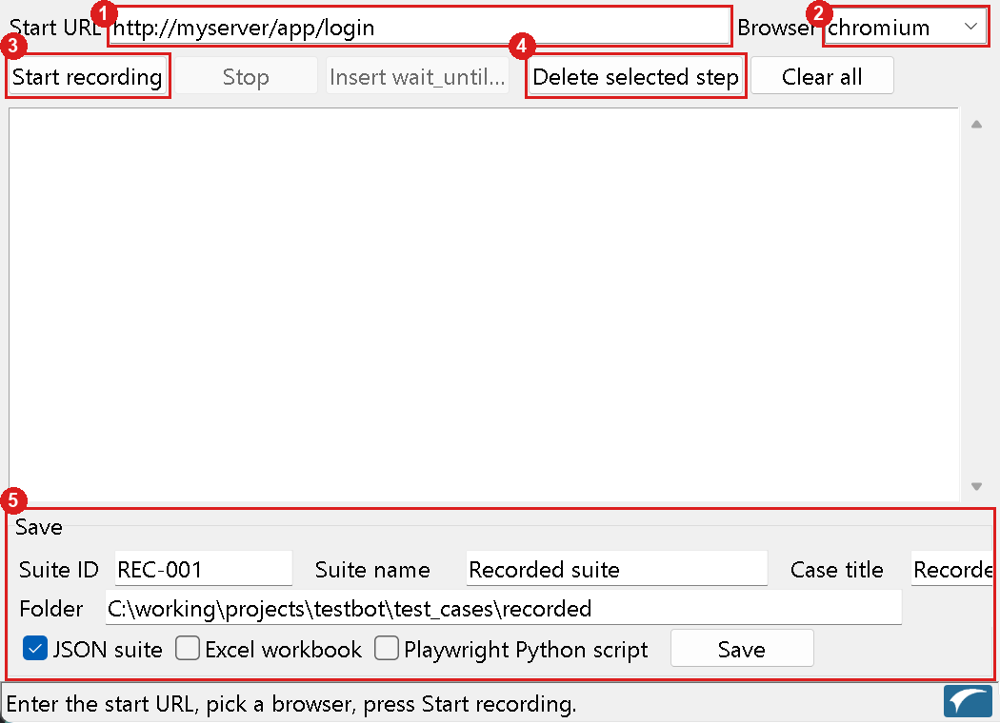

*The recorder window. (1) Start URL · (2) Browser · (3) Start recording · (4) Delete selected step / Clear all · (5) the Save section.*

| Field / button | What it does |
|---|---|
| **Start URL** | The first page to open. **Include `http://` or `https://`** and use the one your site really uses. (`https://` on a site that only answers on `http://` fails with *ERR_CONNECTION_RESET*.) |
| **Browser** | `chromium` (built in, recommended), `msedge` or `chrome` (must be installed). |
| **Start recording** | Opens the browser window on the Start URL and begins capturing. |
| **Stop** | Ends recording. Closing the browser window also stops it. |
| **Insert wait_until…** | Adds a "wait for this to appear/disappear" step by hand (see 4.4). |
| **Delete selected step** / **Clear all** | Remove mistakes from the list. |
| **Save** | Writes the test to the folder shown, in the formats ticked. |

### 4.2 Recording

Use the application normally in the browser window that opens (not in the recorder window). This is the
page being recorded — here a small demo site:

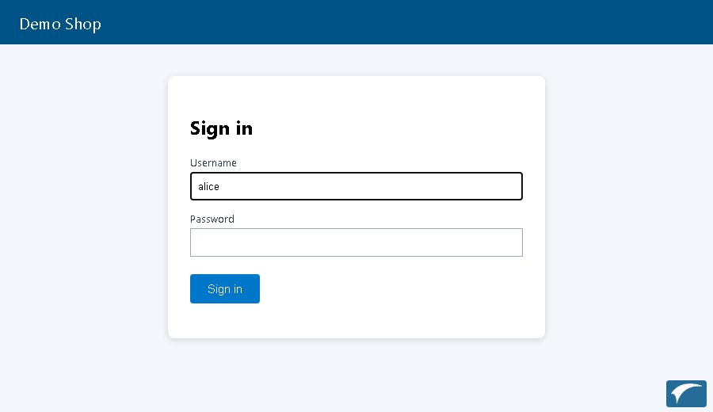

Each action appears in the recorder's list as you do it:

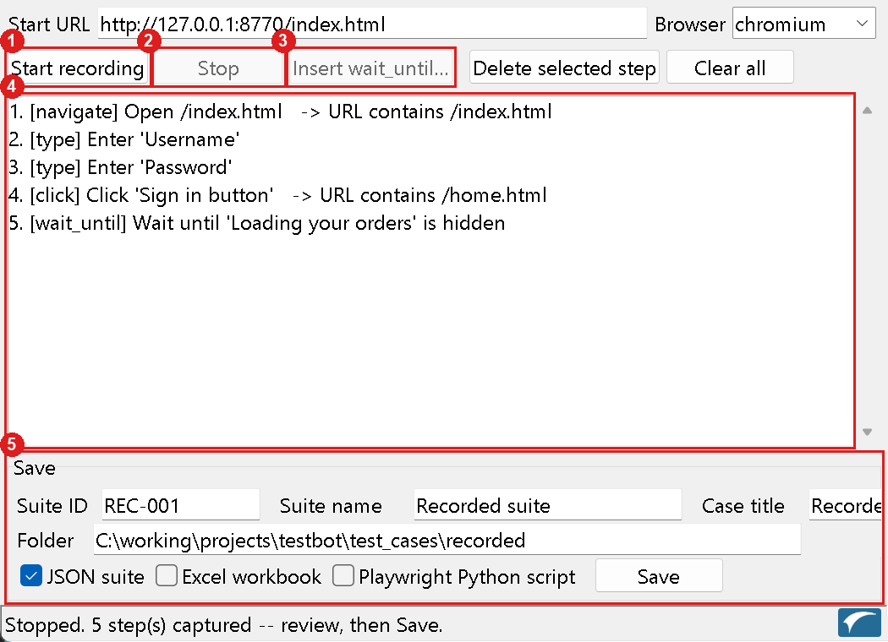

*After recording and stopping. (1) Start recording (2) Stop (3) Insert wait_until… (4) the recorded steps, one line per step, with the "URL contains…" check the recorder added after a click that changed the page (5) Save.*

What each action is recorded as:

| You do | Recorded as |
|---|---|
| Open the first page, or type a new address | `navigate` |
| Click a button, link, checkbox, tab, menu item | `click` |
| Type in a field and leave it (Tab / click elsewhere / Enter) | `type` — only the final text is kept |
| Choose an entry in a dropdown | `select` |
| Press Enter in a field, or Escape | `press` |
| Any click or Enter that changes the page | the step also gets a check **"URL contains …"** |

**Passwords are never saved as typed.** A password field is recorded as `{password}` (a second one as
`{password_2}`) and the suite gets a variable `password = CHANGE_ME`. Edit the saved file and put the
real value in (section 10), or better, keep it out of the file and supply it another way your team prefers.

Tips for a clean recording:

- Do the scenario once, slowly, the way a user would. Don't click around aimlessly — every click becomes a step.
- If a page shows *"Loading…"* after an action, note it: add a `wait_until` step there (4.4). Recorded tests move as fast as the page allows, and the recorder cannot see that you waited.
- If you make a mistake, keep going, then select the wrong steps in the list and press **Delete selected step**.
- Pop-up windows and new tabs are captured too.

### 4.3 Saving

Fill in the **Save** section and press **Save**:

| Field | Meaning |
|---|---|
| Suite ID | File name (`REC-001` becomes `REC-001.json`) and the ID shown in reports. |
| Suite name / Case title | Descriptions shown in reports. |
| Folder | Default `test_cases\recorded` next to the program. **Browse…** to change. |
| Formats | **JSON suite** (recommended), **Excel workbook**, **Playwright Python script** (for people who want plain Playwright code, not testbot). Tick any combination. |

The recorded address becomes the suite's `base_url`, and navigations use `{base_url}`, so the same test
can be pointed at another server later by changing one value (section 11).

### 4.4 Inserting a "wait until" step

Loading indicators, spinners and slow screens are the most common reason a recorded test fails on
replay. Press **Insert wait_until…** while recording (or at any time before saving) and fill in the dialog:

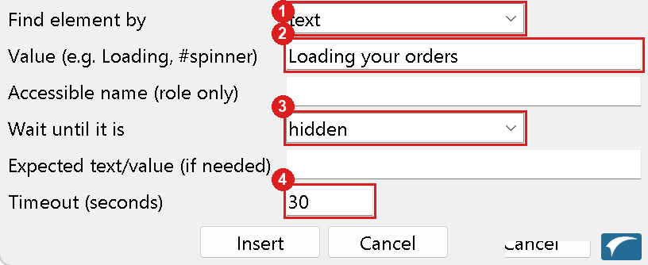

*(1) how to find the element · (2) its text or selector · (3) the condition to wait for · (4) how long to wait at most.*

For example:

| Field | Example |
|---|---|
| Find element by | `text` |
| Value | `Loading` |
| Wait until it is | `hidden` |
| Timeout (seconds) | `30` |

This adds the step "wait until the text *Loading* is hidden". Other conditions: `visible`, `has_value`
(field is not empty), `value` (field equals…), `text` (element text equals…), `text_contains`.

The step is added at the **end of the list so far**. If you add it later, it goes last — open the saved
file and move it (Excel: move the row and renumber; JSON: move it in the `steps` list).

### 4.5 After recording — do this before you rely on the test

1. **Open the saved file** and read the steps. Rename the descriptions to be meaningful.
2. **Fill in `CHANGE_ME`** (passwords).
3. **Add checks.** The recorder only checks that the *URL* changed. A test with no checks on the *content*
   proves very little. Add an `expected` to key steps, for example "text `Welcome` is visible" (section 9).
4. **Run it** with `--headed` and watch it (section 14). Fix what fails.
5. **Re-run it** two or three times. Steps that pass once and fail later usually need a `wait_until`.

### 4.6 What the recorder does not capture

- Hover, drag and drop, right-click, keyboard shortcuts other than Enter/Escape.
- Content inside an *iframe* is recorded, but testbot may not find it on replay (you can point a step at an iframe with the `frame` option, section 8).
- A file upload is recorded with an empty file path — put the real path in the step's `input`.
- What you *see* — the recorder cannot know what should be true. That is what checks are for.

---

## 5. Writing tests in Excel

Excel is convenient for people who prefer tables. One workbook = one suite.

### 5.1 Sheets

| Sheet | Required | Purpose |
|---|---|---|
| **Suite** | yes | One row with the suite settings. |
| **Index** | yes | Which cases to run, in which order. |
| **Connections** | no | Database connections (section 12). |
| **CommonData** | no | Variables shared by every case (section 10). |
| **one sheet per case** | yes | The steps. The sheet name must equal the case's `CaseID`. |

**Suite sheet** — header row, then one row:

| Column | Meaning |
|---|---|
| `SuiteID`, `SuiteName` | Identity, shown in reports. |
| `BaseUrl` | The application address; becomes `{base_url}`. (Optional if you use `--env`.) |
| `Environment` | Optional named block from `config\environments.yaml` (section 11). |
| `OnCaseFail` | `continue` (default) or `stop` — what to do after a case fails. |
| `DefaultStepDelayMs` | Pause after every step in milliseconds (default 0). |
| `Device` | Optional, e.g. `iPhone 13`, `Pixel 7`, `Desktop Chrome` (section 11). |
| `ViewportWidth`, `ViewportHeight` | Optional custom window size (ignored if `Device` is set). |
| `Workers`, `Iterations`, `DurationSec`, `RampUpSec` | Optional load-test settings (section 17). Leave empty for a normal run. |

**Index sheet** — header `Sequence, CaseID, Run`:

| Sequence | CaseID | Run |
|---|---|---|
| 1 | TC-001 | Y |
| 2 | TC-002 | N |

`Run` = `N` skips a case. `Sequence` sets the order.

**Connections sheet** — header `Name, ConnectionString` (one row per database).

**CommonData sheet** — header `VarName, Source, Value` (plus `Query, Connection, Column, Type, Pattern` for
database and generated values, section 10).

**Case sheet** — top: `Key | Value` rows, then one blank row, then the steps table starting at the row
whose first cell is `StepNo`:

```
Title          | Successful login
AreaPath       | Security/Login          (optional)
Priority       | 1                       (optional)
Preconditions  | User exists             (optional)
               |
StepNo | Description | Action | TargetStrategy | TargetValue | TargetName | Input | ...
1      | Open login  | navigate | url          | {base_url}/login |
2      | Enter user  | type     | label        | Username         |       | tomsmith
3      | Click login | click    | role         | button           | Login |
```

### 5.2 Step columns

| Column | Meaning |
|---|---|
| `StepNo` | Order within the case. |
| `Description` | What the step does, in plain words (shown in the report). |
| `Action` | See section 7. |
| `TargetStrategy`, `TargetValue`, `TargetName` | How to find the element (section 8). `TargetName` is used only with `role`. |
| `TargetNth`, `TargetRow`, `TargetCol`, `TargetScope`, `TargetFrame`, `TargetScopeIfPresent` | Optional refinements (section 8): the *n*-th match, table row/column, search inside a container, inside an iframe, or inside a pop-up while it is open. |
| `Input` | The text to type / option to choose / milliseconds to wait, etc. |
| `Query`, `Connection` | For database steps (section 12). |
| `ExpectedType`, `ExpectedValue` | The check for this step (section 9). |
| `ExpectedTargetStrategy`, `ExpectedTargetValue`, `ExpectedTargetName` (+ `…Nth`, `…Row`, `…Col`, `…Scope`, `…Frame`, `…ScopeIfPresent`) | The element the check looks at. |
| `ExpectedColumn` | For database checks: which column. |
| `ExpectedProperty`, `ExpectedRows`, `ExpectedItem`, `ExpectedStyleItem` | For `css_equals` / `list_matches` (section 9.1). For `list_matches`, `ExpectedValue` holds the list of row entries as JSON. |
| `CaptureVar`, `CaptureFrom` | Save a value into a variable (section 9). |
| `CaptureTargetStrategy`, `CaptureTargetValue`, `CaptureTargetName` (+ the same optional refinements), `CaptureColumn` | Where to read it from. |
| `DelayAfterMs` | Pause after this step only. |
| `TimeoutMs` | How long to wait for this step (default 10000 = 10 s). |
| `Config` | Extra settings as JSON, for REST/message-bus steps and a few options (sections 7 and 13). |

Leave columns you don't need empty. Add only the optional columns you use — for example a `TargetNth` column
with `2` on the rows that need "the 2nd match".

The example workbook `test_cases\examples\excel_demo.xlsx` shows the layout.

---

## 6. Writing tests in JSON

The same test as the Excel example:

```json
{
  "suite_id": "LOGIN-001",
  "suite_name": "Login smoke test",
  "base_url": "https://the-internet.herokuapp.com",
  "on_case_fail": "continue",
  "cases": [
    {
      "id": "TC-001",
      "title": "Successful login shows the secure area",
      "steps": [
        {
          "step_no": 1,
          "description": "Open the login page",
          "action": "navigate",
          "target": {"strategy": "url", "value": "{base_url}/login"}
        },
        {
          "step_no": 2,
          "description": "Enter the user name",
          "action": "type",
          "target": {"strategy": "label", "value": "Username"},
          "input": "tomsmith"
        },
        {
          "step_no": 3,
          "description": "Enter the password",
          "action": "type",
          "target": {"strategy": "label", "value": "Password"},
          "input": "SuperSecretPassword!"
        },
        {
          "step_no": 4,
          "description": "Click Login and check the welcome message",
          "action": "click",
          "target": {"strategy": "role", "value": "button", "name": "Login"},
          "expected": {
            "type": "text_contains",
            "value": "You logged into a secure area",
            "target": {"strategy": "css", "value": "#flash"}
          }
        }
      ]
    }
  ]
}
```

Fields of a **step**:

| Field | Meaning |
|---|---|
| `step_no`, `description`, `action` | Required. |
| `target` | `{"strategy": …, "value": …, "name": …, "nth": …, …}` (section 8). |
| `input` | Text to type, option to select, milliseconds to wait, key to press… |
| `expected` | `{"type": …, "value": …, "target": …}` (section 9). |
| `capture` | `{"var": "Name", "from": "element_text", "target": {…}}` (section 9). |
| `query`, `connection` | Database steps (section 12). |
| `config` | Extra settings object (sections 7 and 13). |
| `timeout_ms` | Max wait for this step (default 10000). |
| `delay_after_ms` | Pause after this step. |

A case can also have `variables` (section 10), `device`/`viewport` (section 11) and the descriptive
fields `area_path`, `priority`, `preconditions`, and the selection fields `tags` and `depends_on` (section 14.1a). Look at the files in `test_cases\examples\` — copy one and change it.

A tip: JSON files can be edited in any text editor, but an editor with JSON checking (Visual Studio
Code is free) will underline typos such as a missing comma.

---

## 7. Step reference: actions

| Action | Target? | Input | What it does |
|---|---|---|---|
| `navigate` | strategy `url` | – | Opens a page. Use `{base_url}/path`. (Or leave the target out and put the address in `input`.) |
| `click` | yes | – | Clicks the element. Option: `"config": {"js_click": true}` clicks via the page's script — for elements covered by another element. |
| `type` | yes | text | Clears the field and types the text. |
| `select` | yes | option value or visible text | Chooses an entry in a dropdown. If the field is a type-ahead input (not a real dropdown), types the text instead. |
| `check` | yes (the checkbox's label) | `true` / `false` | Ticks or unticks a checkbox only if it isn't already in that state. |
| `hover` | yes | – | Moves the mouse over the element. |
| `press` | yes | key name, e.g. `Enter`, `Tab`, `Escape` | Presses a key in the element. |
| `scan` | **no** | text | Types into whatever currently has focus, like a barcode scanner. |
| `scroll` | optional | `down:500`, `up:500`, `top`, `bottom`… | With a target and no input: scrolls the element into view. |
| `upload` | yes (file input) | file path | Attaches a file. |
| `wait` | no | milliseconds | Simply waits. Slow and fragile — prefer `wait_until`. |
| `wait_until` | yes | condition (below) | Waits until the element reaches a condition, up to `timeout_ms`. |
| `screenshot` | no | file name | Saves an extra screenshot. (A screenshot is already taken for every step.) |
| `sql_query` | no | – | Runs a `SELECT` (section 12). |
| `sql_exec` | no | – | Runs an INSERT/UPDATE/DELETE/procedure (section 12). |
| `set_var` | no | value | Sets a variable (needs a `capture` block naming it). |
| `assert` | no | – | Does nothing except evaluate the step's `expected` check. |
| `rest_call` | no | – | Calls a web API (section 13). |
| `bus_subscribe`, `bus_wait`, `bus_publish` | no | – | Message bus steps (section 13). |

### wait_until conditions (the `input`)

| Input | Waits until… |
|---|---|
| `hidden` (default) | the element is gone or not visible — e.g. a "Loading…" text disappears. |
| `visible` | the element is shown. |
| `has_value` | an input field is not empty. |
| `value:ABC` | an input field's value equals `ABC`. |
| `text:ABC` | the element's text equals `ABC`. |
| `text_contains:ABC` | the element's text contains `ABC`. |

If the condition isn't met within `timeout_ms` (default 10 s; set a larger value for slow screens), the step **fails**.

Example — wait for the menu to finish loading:

```json
{"step_no": 5, "description": "Wait for the menu to load", "action": "wait_until",
 "target": {"strategy": "text", "value": "Loading"}, "input": "hidden", "timeout_ms": 30000}
```

### Pacing

- `default_step_delay_ms` (suite) — pause after every step.
- `delay_after_ms` (step) / `DelayAfterMs` (Excel) — pause after one step, overriding the suite default.
- Steps that click or type automatically wait up to `timeout_ms` for the element to appear.

---

## 8. Finding elements on the page (targets)

A **target** says which element a step works on. It has a `strategy` (how to look) and a `value`.
The strategies, from most to least robust:

| Strategy | `value` is… | Example |
|---|---|---|
| `role` | the kind of element; add `name` for its visible name | `{"strategy":"role","value":"button","name":"Login"}` |
| `label` | the text of the field's label | `{"strategy":"label","value":"Username"}` |
| `placeholder` | the grey hint text inside a field | `{"strategy":"placeholder","value":"Search…"}` |
| `text` | text shown on the page | `{"strategy":"text","value":"Welcome"}` |
| `testid` | the element's `data-testid` attribute | `{"strategy":"testid","value":"save-btn"}` |
| `css` | a CSS selector | `{"strategy":"css","value":"#flash"}` |
| `xpath` | an XPath | `{"strategy":"xpath","value":"//table//tr[2]"}` |
| `row_containing` | text somewhere in a table row | `{"strategy":"row_containing","value":"John Smith"}` |
| `table_cell` | a CSS selector for the table; add `row` and `col` (1-based) | `{"strategy":"table_cell","value":"#orders","row":3,"col":2}` |
| `url` | (navigate only) the address | `{"strategy":"url","value":"{base_url}/login"}` |
| `ai` | a plain-English description | `{"strategy":"ai","value":"the blue Save button"}` |

Common `role` values: `button`, `link`, `textbox`, `checkbox`, `radio`, `combobox` (dropdown), `heading`, `tab`, `menuitem`.

### Getting exactly one element

A target must match **one** element. If it matches none or several, the step errors. You can narrow it:

| Option | Use |
|---|---|
| `"nth": 2` | "the 2nd match" (1 = first). |
| `"scope": "#table1"` | only search inside the element matching this CSS selector. |
| `"frame": "iframe.content"` | search inside an iframe. |
| `"scope_if_present": ".popup"` | search inside this container only while it exists, e.g. an open pop-up. |

In Excel these are the optional columns `TargetNth`, `TargetScope`, `TargetFrame`, `TargetScopeIfPresent` (and `TargetRow`/`TargetCol` for `table_cell`).

*If a target matches nothing or more than one element, testbot can ask an AI service to guess (section 11). If you
have not set that up you will see an error mentioning `ANTHROPIC_API_KEY` — the real fix is to make the target more specific.*

**How to find a good target:** in the browser, right-click the element → *Inspect*. Look for a visible label or
name (use `label`/`role`), or an `id` (use `css` with `#theid`). The recorder chooses one for you automatically.

---

## 9. Checking results and reading values

### Expected (checks)

Add `expected` to a step. It is checked **after** the step's action.

| `type` | Checks that… | `value` | `target` |
|---|---|---|---|
| `url_equals` | the page address equals | address | – |
| `url_contains` | the page address contains | text | – |
| `text_equals` | the element's text equals | text | element |
| `text_contains` | the element's text contains | text | element |
| `value_equals` | the field's value equals | text | element |
| `visible` | the element is shown | – | element |
| `hidden` | the element is not shown | – | element |
| `count_equals` | number of matching elements | number | element (don't use `nth`) |
| `sql_result_equals` | the last `sql_query` result equals | value | – (`column` optional) |
| `css_equals` | a displayed style (default: background colour) equals | colour or value | element (`property` optional) |
| `has_class` | the element has this CSS class (or all of a list) | class name(s) | element |
| `list_matches` | the **top N rows of a table/list** match, in order (text, colours, classes) | list of row specs | the table/list (section 9.1) |

If the check doesn't hold, the step **fails** and the report shows *expected vs. actual*.

```json
{"step_no": 6, "description": "Total is shown", "action": "assert",
 "expected": {"type": "text_equals", "value": "$120.00",
              "target": {"strategy": "css", "value": "#total"}}}
```

### 9.1 Checking colours, classes and the order of a list

Use these when a test must confirm **what the user sees**: that the first items of a table are in the right order, and that
each is coloured correctly.

**A single element's colour — `css_equals`.** Compares the colour the browser really shows (from a style sheet, an inline
style or a script — it does not matter how the page sets it). Write the expected colour any way you like: `#ffcccc`,
`rgb(255, 204, 204)`, `red`. Use `property` for another style, e.g. `"property": "color"` (text colour) or `"font-weight"`.

```json
{"step_no": 8, "description": "The late order is shown in red", "action": "assert",
 "expected": {"type": "css_equals", "value": "#ffcccc",
              "target": {"strategy": "css", "value": "#orders tbody tr:nth-child(1)"}}}
```

**A class — `has_class`.** Use it when the page marks the state with a class name instead of (or as well as) a colour:

```json
{"expected": {"type": "has_class", "value": "status-late",
              "target": {"strategy": "css", "value": "#orders tbody tr:nth-child(1)"}}}
```

**The top N rows, in order — `list_matches`.** Point the target at the **table or list itself** and give one entry per row
you want checked, from the top. Only as many rows as you list are checked (list 5 = the top 5); if the table has fewer rows
the check fails.

```json
{"step_no": 9, "description": "Top 3 orders: sequence and colours", "action": "assert",
 "expected": {
   "type": "list_matches",
   "target": {"strategy": "css", "value": "#orders"},
   "item": "td:nth-child(1)",
   "style_item": "row",
   "value": [
     {"text": "Order-A", "background": "#ffcccc"},
     {"text": "Order-B", "background": "rgb(255, 255, 153)"},
     {"text": "Order-C", "class": "normal"}
   ]}}
```

What each row entry may contain (use only what you want to check):

| Key | Checks that… |
|---|---|
| `text` | the row's text equals this (extra spaces are ignored) |
| `text_contains` | the row's text contains this |
| `background` | the background colour equals this (`bg` also works) |
| `color` | the text colour equals this |
| `css` | other styles, e.g. `{"font-weight": "bold"}` |
| `class`, `not_class` | the element has / does not have this class (one name or a list) |

Settings that say **where** to look, all optional:

| Setting | Meaning |
|---|---|
| `rows` | CSS selector for the rows inside the target. Not needed for a normal table (body rows) or an Apriso `.DynamicGrid` (data rows, skipping its empty placeholder row); for other lists the direct children are used. |
| `item` | CSS selector *inside a row* for the element whose **text** is read. Default: the whole row. |
| `style_item` | The element whose **colour/classes** are read. Default: the same as `item`. Write `"row"` to read the row itself. |

**Whole-row text:** without `item`, `text` is the visible text of the whole row, cells separated by one space —
e.g. `Order-A Late`. Usually it is clearer to pick one cell with `item`.

**Apriso grids (`.DynamicGrid`)**

```json
{"type": "list_matches",
 "target": {"strategy": "css", "value": ".DynamicGrid", "frame": ".apr-fullscreen-tab", "scope_if_present": ".apr-popup"},
 "item": "[data-field='productionlineno' i]",
 "style_item": "row",
 "value": [{"text": "1000_AutoTest_Line", "background": "white"},
           {"text": "32_TestLine", "background": "#f2f2f2"}]}
```

- Column names in `data-field` are lower case in Apriso (`productionlineno`); the `i` after the name makes the match ignore case.
- Apriso grids alternate row colours (white / light grey), so check `background` on the **row** (`"style_item": "row"`).
- Only rows that are on screen at that moment are read — if the grid pages or scrolls, check the first page.

**When it fails**, the report shows *expected* and *actual* side by side, one line per row, and marks the row that
differs:

```
expected:  1. text='Order-A', background-color=#ffcccc
           2. text='Order-B', background-color=rgb(255,255,153)
actual:    1. text='Order-A', background-color=rgb(255, 204, 204)
           2. text='Order-C', background-color=rgb(255, 255, 153)   <-- differs
```

**Excel:** use the columns `ExpectedType` (`list_matches`), `ExpectedValue` (the list, written as JSON in one cell),
`ExpectedTargetStrategy`/`ExpectedTargetValue`, and the optional `ExpectedRows`, `ExpectedItem`, `ExpectedStyleItem`,
`ExpectedProperty` (for `css_equals`).

### Capture (saving a value)

Add `capture` to save something the application shows into a variable:

| `from` | Saves |
|---|---|
| `element_text` | the element's text (`target` required) |
| `element_value` | the field's value (`target` required) |
| `url` | the current page address |
| `sql_column` | a column of the last `sql_query` result (`column`, default first column) |

```json
{"step_no": 7, "description": "Remember the order number", "action": "click",
 "target": {"strategy": "role", "value": "button", "name": "Save"},
 "capture": {"var": "OrderNo", "from": "element_text",
             "target": {"strategy": "css", "value": "#order-number"}}}
```

Later steps use `{OrderNo}`.

---

## 10. Variables and test data

A variable is written `{name}`. You can use it in: `input`, a target's `value`, `expected.value`, database
`query` text, and REST/bus `config` values. Using a variable that does not exist is an error that lists the
variables that do.

### Built-in
- `{base_url}` — the application address (section 11).
- `{worker_id}` — the number of the worker process running the test (1, 2, 3…; always `1` in a normal run).
- `{iteration}` — how many times this worker has run the test so far (1, 2, 3…; always `1` in a normal run).

`{worker_id}` and `{iteration}` exist so that several copies of the same test running at once can use different
data — see section 17. Example input: `user{worker_id}` types `user1`, `user2`, `user3` in the three workers.

### Suite-level variables (shared by every case)
JSON: a `variables` object at the top of the suite. Excel: the `CommonData` sheet.

### Case-level variables
JSON: `variables` inside a case. A case variable with the same name overrides the suite one.

Each variable has a `source`:

| `source` | Meaning | Fields |
|---|---|---|
| `constant` | a fixed value | `value` |
| `faker` | a generated value (new every run) | `type` (a Faker generator, e.g. `email`, `first_name`, `bothify`), `pattern` for `bothify` |
| `sql` | the first value returned by a query | `query`, `connection` (default `default`), `column` (optional) |

```json
"variables": {
  "username":  {"source": "constant", "value": "tomsmith"},
  "email":     {"source": "faker", "type": "email"},
  "orderCode": {"source": "faker", "type": "bothify", "pattern": "ORD-####"},
  "productId": {"source": "sql", "query": "SELECT ProductID FROM PRODUCT WHERE PartNo = 'PartABC'"}
}
```

Generated and database values are created **once, before step 1** of each case.

### Values captured during the test
Section 9 — `capture` creates a variable at that step.

### Passwords and secrets
Avoid typing real passwords into files that are stored in shared folders or source control. Options: keep the
suite file in a private location; keep only a placeholder such as `CHANGE_ME` in the shared copy and fill it
in on the machine that runs the test.

---

## 11. Settings

### 11.1 Where settings can live

There are two places, and **the suite wins**:

1. **In the suite itself** (recommended): `base_url`, `connections`, `variables` (JSON: top of the file;
   Excel: `Suite` sheet `BaseUrl`, `Connections` sheet, `CommonData` sheet).
2. **In `config\environments.yaml`** — named environments you select with `--env`. Useful when the same test must
   run against several servers (dev, QA, production-like).

```yaml
demo:
  base_url: "https://the-internet.herokuapp.com"
  connections: {}

qa:
  base_url: "https://qa.example.local/portal"
  connections:
    default: "Driver={ODBC Driver 18 for SQL Server};Server=QA-SQL01;Database=MyDb;Trusted_Connection=yes;Encrypt=no;"
```

Run against QA: `testbot.exe suite --suite mytest.json --env qa`.
A suite that sets its own `base_url` needs no `--env` at all. If both exist, the suite's `base_url` is used and
the connections are merged (suite entries override same-named environment entries).

### 11.2 Timeouts and delays
`timeout_ms` per step (default 10000). Section 7 covers delays.

### 11.3 Mobile and different window sizes

| Setting | Meaning |
|---|---|
| `device` | A device name: `"iPhone 13"`, `"Pixel 7"`, `"iPad Mini"`, `"Desktop Chrome"`… Real emulation (size, touch, browser identity). Still runs Chromium. |
| `viewport` | `{"width": 390, "height": 844}` — just a window size. |

Set on the suite (all cases) or on one case. On the command line, `--device` / `--viewport` override everything.
Different cases in one suite can use different devices.

### 11.4 AI element finder (optional)

Only used when a step says `"strategy": "ai"`, or when a normal target finds no element/several. Nothing else
needs it. To enable it, set environment variables **before** running (they are not read from a file):

| `AI_VISION_PROVIDER` | Also set |
|---|---|
| `anthropic` (default) | `ANTHROPIC_API_KEY` |
| `openai` | `OPENAI_API_KEY` |
| `azure_openai` | `AZURE_OPENAI_API_KEY`, `AZURE_OPENAI_ENDPOINT`, `AZURE_OPENAI_DEPLOYMENT` |
| `gemini` | `GEMINI_API_KEY` |

**Or use a `.env` file** (simplest): create a plain text file named `.env` next to `testbot.exe` (or in the folder you run it from; for the manager also in the workspace folder) with one `NAME=value` per line, for example

```
AI_VISION_PROVIDER=openai
OPENAI_API_KEY=sk-...
```

It is read when the program starts. A real environment variable always wins over the file, and only the variable *names* are ever printed. The file holds secrets: keep it private and never share or commit it. (The manager and every test it starts use it too.)

`AI_VISION_MODEL` overrides the model. Example (Windows command prompt):

```
set ANTHROPIC_API_KEY=your-key
testbot.exe suite --suite mytest.json
```

Screenshots of the page are sent to that service when it is used. Do not use it on pages with data that must not leave your network.

### 11.5 Company networks: root certificates and proxy

Many companies inspect HTTPS traffic: a proxy re-signs every site with the company's own **root certificate**. Programs that only know the public
certificate list then fail with *“certificate verify failed”*, and the AI service (and any HTTPS call) is blocked. testbot can trust your company's
root certificate. It trusts, together: (1) the operating system's certificate store (on Windows, where IT installs company certificates),
(2) the public certificate list, and (3) any extra root certificate file you name.

| Environment variable | Meaning |
|---|---|
| `TESTBOT_SSL_CA_BUNDLE_FILE=C:\certs\company-root.pem` | Path of your company's root certificate — a `.pem`, `.crt` or binary `.cer` file, a folder of such files, or several separated by `;`. (This is the same idea as `MOM_MCP_SSL_CA_BUNDLE_FILE` in mom-mcp. The common `SSL_CERT_FILE` / `REQUESTS_CA_BUNDLE` are also read.) |
| `TESTBOT_SSL_USE_OS_TRUSTSTORE=1` | Trust the operating system's certificate store (default **on**; `0` turns it off). |
| `TESTBOT_PROXY=http://proxy.company.com:8080` | Send the calls through this proxy. (`HTTPS_PROXY` is used automatically if set.) |

Where it applies: the AI element finder (`strategy: "ai"`, section 8), the manager's AI assistant (section 20.7) and `rest_call` steps
(also settable per step with `"ca_bundle": "C:\\certs\\company-root.pem"`, section 13.1). If your company provides an **internal AI gateway**, set
`ANTHROPIC_BASE_URL` / `OPENAI_BASE_URL` / `AZURE_OPENAI_ENDPOINT` to its address.

In the manager, the same three settings are on the **Settings** page under *Company network*, with a **Test connection to the AI service** button that
reports success or exactly what is wrong (untrusted certificate, bad certificate file, proxy problem, unreachable). Tests started from the manager
(Run now, schedules) inherit these settings automatically. Ask your IT department for the root certificate if you do not have it.

---

## 12. Database steps

Use these to prepare data, read values, or verify what the application saved.

1. Provide a connection — `connections` in the suite (Excel: `Connections` sheet) or in `environments.yaml`:
   ```
   "connections": {"default": "Driver={ODBC Driver 18 for SQL Server};Server=myserver;Database=MyDb;UID=me;PWD={env:TESTBOT_DB_PASSWORD};Encrypt=no;TrustServerCertificate=yes;"}
   ```
   The name `default` is used when a step doesn't say otherwise; add more names and use them in a step's `connection`.
2. Use the steps:

| Action | `query` | Notes |
|---|---|---|
| `sql_query` | a single `SELECT` | The **first row** is kept. Use `expected` type `sql_result_equals` to check it, and/or `capture` from `sql_column`. |
| `sql_exec` | INSERT / UPDATE / DELETE / procedure call | For test set-up and clean-up. |

Example — check the application saved the record:

```json
{"step_no": 9, "description": "The order was saved", "action": "sql_query",
 "query": "SELECT COUNT(*) FROM ORDERS WHERE OrderNo = '{OrderNo}'",
 "expected": {"type": "sql_result_equals", "value": "1"}}
```

**Waiting for the application to finish saving:** add `"config": {"poll": true}` and a `timeout_ms` (for example
15000). testbot then repeats the query every second until the result matches or the time is up. Without it, the
query runs once, and may run before the application has committed its data.

⚠ `sql_exec` changes real data. Point tests at a test database, and know what each step changes.

**Variables in SQL are sent as parameters.** `{OrderNo}` in a query is passed to the database as a bound parameter, not
pasted into the SQL text, so a value with a quote (`O'Brien`) works and text captured from the application cannot change
the statement. Write queries exactly as before: `'{OrderNo}'`, `N'%{name}%'` and `WHERE Id = {id}` all work. A plain
number is written inline (so `TOP {n}` works). For a table or column name built at run time use `[{name}]` (plain names
only) or `{raw:name}` (written into the SQL unchanged -- never use it with values captured from the application).

**Passwords and logins.** Write `PWD={env:TESTBOT_DB_PASSWORD_QA}` instead of the password; the value is read from that
environment variable (or `.env`) when the connection opens. Only names starting with `TESTBOT_DB_` are allowed. For the
agent (`query_db`, SQL checks) and the manager's *Try* dialog, use a database login that can **only read**
(`db_datareader`): those queries are limited to one `SELECT` and always rolled back, but the read-only login is the real
protection.

---

## 13. REST calls and message-bus steps

These steps need no target; everything is in the step's `config`. Values inside `config` may use `{variables}`.

### 13.1 REST call — `rest_call`

| `config` field | Meaning |
|---|---|
| `url` | Full address. |
| `method` | `GET` (default), `POST`, `PUT`, `DELETE`… |
| `params` | Query-string values `{"page": "1"}`. |
| `headers` | Extra headers. |
| `body` | An object/list (sent as JSON) or plain text. |
| `auth` | `{"type":"bearer","token":"…"}`, `{"type":"basic","username":"…","password":"…"}`, or `{"type":"header","name":"X-Key","value":"…"}`. |
| `verify_tls` | `false` to accept a self-signed certificate (turns checking off — avoid). |
| `ca_bundle` | Path of your company's root certificate (`.pem`/`.crt`/`.cer`, a folder, or several separated by `;`) — the safe alternative to `verify_tls: false` (section 11.5). |
| `expect_status` | A number or list, e.g. `201` or `[200, 204]`. |
| `expect_json` | Checks on the answer: `{"json.item": "A-100"}` (path → expected value). |
| `capture` | Save values into variables: `{"echoed_qty": "json.qty", "code": "$status"}`. `$status` and `$body` are available. |

Paths look like `data.items[0].id`.

```json
{"step_no": 1, "description": "Create an order", "action": "rest_call",
 "config": {"url": "{api}/orders", "method": "POST",
            "auth": {"type": "bearer", "token": "{token}"},
            "body": {"item": "A-100", "qty": 2},
            "expect_status": 201, "expect_json": {"status": "New"},
            "capture": {"order_id": "id"}}}
```

### 13.2 Message bus — MQTT, AMQP (RabbitMQ), Kafka

Typical pattern: **subscribe first**, do the thing that causes a message (a click, a REST call, a publish), then **wait** for it.

| Action | Purpose | Main `config` fields |
|---|---|---|
| `bus_subscribe` | Start listening. Closed automatically at the end of the case. | `broker` (`mqtt`/`amqp`/`kafka`), `host`, `port`, `username`, `password`, `tls`, `name` (default `default`); MQTT `topic`; AMQP `queue` or `exchange`+`routing_key`; Kafka `topic`, `group_id` |
| `bus_wait` | Wait for a matching message. Fails after `timeout_ms`. | `name`, `match` (`{"orderNo": "WO-1001"}` on the JSON body), `topic_contains`, `expect_json`, `capture` (`$topic`, `$body` available) |
| `bus_publish` | Send a message. | `broker`, connection fields, `topic` (AMQP: `routing_key`), `payload` (object → JSON) |

See `test_cases\examples\rest_bus_demo.json`. (MQTT has been tried against a real broker; AMQP and Kafka support is included but less proven — try it on your broker first.)

---

## 14. Running tests

All commands are typed in a command prompt (Windows: press the Start key, type `cmd`, Enter; then `cd` to the testbot folder).

### 14.1 Run a suite

```
testbot.exe suite --suite <file> [--env <name>] [options]
```

| Option | Meaning |
|---|---|
| `--suite` | Required. The `.json` or `.xlsx` file. |
| `--env` | Optional. A block of `config\environments.yaml`. |
| `--headed` | Show the browser window (default: hidden). Use it while developing a test. |
| `--report-dir` | Where results go (default `reports`). |
| `--device "iPhone 13"` | Run everything as that device. |
| `--viewport 390x844` | Run everything with that window size. |

Examples:

```
testbot.exe suite --suite test_cases\recorded\REC-001.json
testbot.exe suite --suite test_cases\login.xlsx --env qa --headed
testbot.exe suite --suite test_cases\login.json --device "Pixel 7" --report-dir results\mobile
```

The final lines summarise each case (`PASS`, `FAIL`, `ERROR`). The program's **exit code** is `0` if every
case passed and `1` otherwise, so schedulers and build pipelines can use it as a pass/fail signal.

### 14.1a Run only some of the test cases (selection)

A suite file may hold many test cases. To run **only some** of them, **in the order you choose**:

```
testbot.exe suite --suite orders.json --case TC-5 --case TC-2          # TC-5 first, then TC-2
testbot.exe suite --suite orders.json --case TC-5,TC-2                 # the same, as a comma list
testbot.exe suite --suite orders.json --tag smoke                      # every case tagged "smoke", in file order
testbot.exe suite --suite orders.json --case TC-1 --case TC-1          # the same case twice (the second is named TC-1~2)
```

- **No `--case` / `--tag` = every case, in file order**, exactly as before.
- **Order:** the cases run in the order you list them. The same id may be listed twice; the repeat is named `TC-1~2` (then `~3` …) so its results and screenshots never overwrite the first run's.
- **Tags:** give a case `"tags": ["smoke", "orders"]` (the editor has a *Tags* field). `--tag` runs the cases that have *any* of the tags (repeat `--tag` for several); together with `--case` it keeps those listed cases that carry a tag.
- **Prerequisites:** a case may say `"depends_on": ["TC-LOGIN"]` (editor: *Depends on*). When you select cases, each one's prerequisites (and theirs) are put **right before it and run in the same browser, with the same variables**, so the login is still there. If the case just before it already is that prerequisite, it is not run again. Running the whole file is not affected: cases then run in file order and each starts clean.
- **Checked first:** an id or tag that does not exist, a missing prerequisite or a circular `depends_on` stops the run **before any browser opens** (exit code 2) and lists what does exist.
- **Reports:** the report and the Results page say "3 of 12 case(s) selected, run in this order: …"; cases you did not select are simply not listed.
- Works with `--workers` / `--iterations` (every worker runs the same selection) and in schedules (an item can carry a case list — section 20.6).

### 14.2 Run automatically (scheduled / build pipeline)

Because it is an ordinary command with an exit code, testbot fits into any scheduler:

- **Windows Task Scheduler:** create a task that runs `testbot.exe suite --suite … --report-dir …` at the times you want.
- **Azure DevOps / any build system:** run the same command as a step, then publish `reports\*-junit.xml` with the
  *Publish Test Results* task (format: JUnit). Results then appear in the Tests tab.
- The machine needs to be logged in / have a desktop session only if you use `--headed`. The default hidden mode
  needs none.

### 14.3 Run the recorder

`testbot-recorder.exe`, or `testbot.exe record`, or `testbot.exe` with no arguments.

### 14.4 Other commands

```
testbot.exe session --plan <plan file>          several files in order (section 16)
testbot.exe convert-apriso --in <file> [--out <file>] [--map <file>]   (section 18)
testbot.exe suite --suite <file> --workers 5 --duration 300 --ramp-up 30   load test (section 17)
testbot.exe --help
```

---

## 15. Reading the results

After a run, `reports\` contains (for suite `LOGIN-001`):

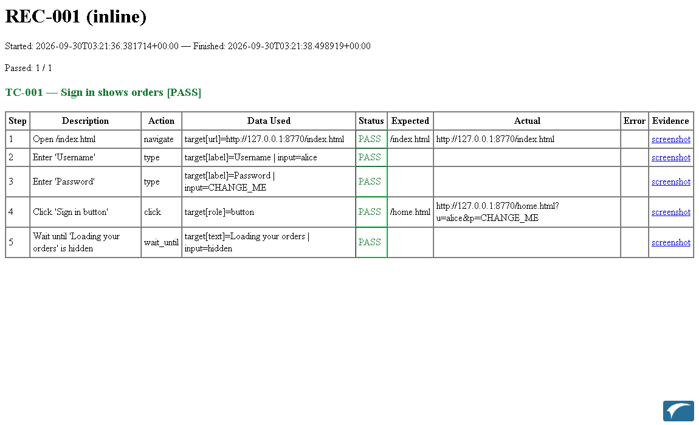

*The HTML report of the recorded sign-in test: every step, what was used, PASS/FAIL, expected vs. actual, and a link to that step's screenshot.*

| File | What it is |
|---|---|
| `LOGIN-001.html` | The report. Open it in a browser. One row per step: description, action, the data actually used, status, expected vs. actual, error message, and a link to the screenshot. |
| `LOGIN-001-junit.xml` | The same results for tools (Azure DevOps, Jenkins). |
| `LOGIN-001-result.json` | Full machine-readable record. |
| `LOGIN-001_<date-time>\run.log` | The step log: one line per event, by level (section 15.1). |
| `LOGIN-001_<date-time>\` | A screenshot after **every** step, passing or not (each carries the small **IACF logo** in the bottom-right corner; set `TESTBOT_WATERMARK=off` to leave it out), named `TC-001_step3_pass.png` / `..._fail.png` / `..._error.png`. Each run gets its own folder, so earlier evidence is kept. |

**Status meanings**

| Status | Meaning |
|---|---|
| `pass` | The step ran and its check (if any) held. |
| `fail` | The step ran but its check did not hold (wrong text, wrong URL, wrong database value, message not received). |
| `error` | The step could not run (element not found, timeout, missing variable, connection problem). |
| `inconclusive` | Used by natural-language (agentic) tests: the test could not be *confirmed* either way — for example it had no script to run, or no check proved an expected outcome (section 21.5). It counts as **not passed** (exit code 1, shown as an error in JUnit). |
| skipped | Not reached because an earlier step in the case stopped it. |

The first failing step ends the case, and its screenshot usually shows exactly what the page looked like at that moment —
start there.

### 15.1 The run log: one line per event

While a test runs, testbot writes a log line for everything it does — on the screen (the console, or the run window of the manager) and into a file **`run.log`** in the run's folder, next to the screenshots. Every line has a time, a **level**, an **area** and the message:

```
2026-10-02 16:18:32 INFO    step      TC-1 step 2 PASS  type         Enter the user (99 ms)
2026-10-02 16:18:33 WARNING step      TC-1 step 4 FAIL  assert       Heading says Goodbye (77 ms) -- expected 'Goodbye', actual 'Hello'
2026-10-02 16:18:35 ERROR   step      TC-2 step 2 ERROR click        Click a button that does not exist (1690 ms) -- Semantic locator ...
```

| Level | What it shows |
|---|---|
| `DEBUG` | What is about to happen and with which data (resolved target and input), SQL text and row counts, case variables (names only), screenshot files, the agent's reasoning. |
| `INFO` (default) | Suite, session and case start and finish; **every step with its result and time**; every agent action; REST / message-bus results; SQL statements that change data. |
| `WARNING` | A failed check (with expected and actual), a failed case, an inconclusive case, a query that failed. |
| `ERROR` | A step or case that could not run (element not found, timeout, missing variable), an agent that could not start, a connection that failed. |

**Areas** (the second column) say where the line comes from: `runner` (suite / session / case), `step`, `sql`, `integration` (REST and bus), `agent`, and — in the manager — `manager` and `scheduler`.

**Passwords and other secrets are masked** (`input=***`): a value typed into a field whose target, description or variable looks like a password / secret / token / API key, and `password=...` style text in SQL and messages, are replaced. Connection strings are never logged.

Choose the level:

| How | Example |
|---|---|
| Command line | `testbot.exe suite --suite login.json --log-level debug` (also for `session`; `testbot-manager.exe --log-level debug`) |
| `.env` file or environment variable | `TESTBOT_LOG_LEVEL=warning` |
| Manager | *Settings → Logging → Log level* (used for the manager and for every test it starts) |
| One area louder or quieter | `TESTBOT_LOG_LEVELS=agent=debug,sql=warning` |
| Also keep one big file | `TESTBOT_LOG_FILE=C:\logs\testbot.log` (rotates at 5 MB, keeps 3 old files) |
| No console output | `TESTBOT_LOG_CONSOLE=off` (the files are still written) |

The command-line option wins over the environment variable, which wins over the Manager setting. In a **load test** every line carries the worker, for example `[w03]`, and each run still gets its own `run.log`.

In the manager, open a run on the **Results** page and expand **Run log**: choose the lowest level to show (for example *Warning* to see only what went wrong), narrow it to one area, or search the text. The manager and the scheduler write to `logs\manager.log` in the workspace folder (set the level to `debug` to include every web request).


### 15.2 Final result and final test time

Every test case records when it **started and finished** (`started_at` / `finished_at`, UTC, in `…-result.json`). The HTML report starts with a **final result block** — PASS / FAIL / ERROR for the run, the **final test date and time** (when it finished), the duration, the counts, and a table of every test case with its result and finish time. A session report has one for the whole session and one per file. At the end of a run the console prints `Final result: PASS - finished 2026-10-03 14:05:09`.

### 15.3 Results by suite, session and test case

In the manager, **Results** has four views (tabs): **By run** (every run, newest first), **By suite**, **By session** and **By test case**. Each row shows the **final result** and the **final test date / time**, how many times it ran, and a small bar of the recent runs (green = pass).

- **Final result** = the result of the **most recent run that included it**, by finish time. Standalone suite runs and session runs count together (a case is identified by its suite ID plus its case ID). If a later run only selected some cases (section 14.1a), the others keep their earlier result. A case repeated inside one run (`TC-1~2`) counts under `TC-1`.
- **By test case** — click a case to open its page: the final result and final test time; **every run** of it (date / time, result, duration, **where it ran** — a standalone suite run, or *session X, entry N* — whether it was part of a selection, and the first problem), filterable by result and by session; **click a run to see that run's step results** (data used, expected against actual, error, screenshots) with buttons for the full run, the HTML report and the run log; and **the sessions that include this test case** (saved session plans) with the latest result of each.
- **By suite** — click a suite for its test cases (each with its final result and time) and all runs of the suite; click a case to open its page.
- **By session** — click a session for its runs; open a run to see every entry and case. On a run page each case has a **history** link to its case page.
- Filter by text, final result and period (last 24 hours / 7 / 30 days); sort by newest, by name or failures first. Load-test runs stay in **By run**.
- The suite and session pages also have an **Analysis** block with charts for a chosen time range; to track a whole test effort (for example UAT) across sessions, suites and cases, use **Test groups** (section 20.8a).

---

## 16. Running several files in order (sessions)

A **session** runs several suite files in a fixed order and produces one combined report. It can keep the same
logged-in browser across files — handy for "log in once, then run many test files".

Create a plan file, e.g. `plans\daily.yaml`:

```yaml
session_id: "DAILY"
session_name: "Login, then the order tests"
environment: "demo"          # optional; each file's own settings win
files:
  - path: "test_cases/01_login.json"
  - path: "test_cases/02_orders.json"
    shares_state_with_previous: true    # continue in the same browser, still logged in
  - path: "test_cases/03_reports.xlsx"
```

Run it:

```
testbot.exe session --plan plans\daily.yaml
```

- Without `shares_state_with_previous`, each file starts with a fresh, empty browser and fresh variables.
- With it, that file continues the exact browser (cookies, page) and variables left by the previous file, and its own cases run one after another without a reset.
- If any case in a file fails, **the session stops before the next file** (change this with `on_fail`, section 16.1).
- Options `--headed`, `--report-dir`, `--device`, `--viewport` work as for a suite. Reports are named after the `session_id`.

### 16.1 Choosing cases inside a session

A session entry runs a **whole test suite** (as above) or **only some of its cases**, in the order you list them. The same file can appear several times — for example log in, then run other cases, then log out:

```yaml
session_id: "DAILY"
session_name: "Login, orders, logout"
on_fail: stop_session            # what a failed case does (see below)
files:
  - path: "test_cases/auth.json"
    cases: [TC-LOGIN]            # only this case
  - path: "test_cases/orders.json"                # no "cases": the whole suite, in file order
    shares_state_with_previous: true
  - path: "test_cases/reports.json"
    cases: [TC-5, TC-2]          # TC-5 first, then TC-2
    shares_state_with_previous: true
  - path: "test_cases/orders.json"
    tags: [cleanup]              # the cases tagged "cleanup"
  - path: "test_cases/auth.json"
    cases: [TC-LOGOUT]
    shares_state_with_previous: true
    on_fail: continue            # this entry's own rule
```

- `cases` and `tags` follow the same rules as `--case` / `--tag` (section 14.1a), including prerequisites (`depends_on`).
- The whole plan is **checked before any browser starts**: every wrong file, case id or tag is listed at once, and the run stops with exit code 2.
- A file listed twice gets its own screenshot prefix (`SUITE-2__…`), so nothing is overwritten.
- **`on_fail`** (session-wide, and optionally per entry) says what a failed case does:

| `on_fail` | Meaning |
|---|---|
| `stop_session` (default) | The file's remaining cases run as that file's own `on_case_fail` says; then the session stops before the next entry. |
| `stop_file` | Stop this file's remaining cases at the first failure, then go on with the next entry. |
| `continue` | Never stop early — not even for a suite whose own `on_case_fail` is `stop`. |

In the manager (*Sessions* page) you do not edit YAML: **+ Add to session…** asks for the test suite and then for **whole suite** or **selected test cases** (tick them, order with ↑↓, or press a *tag:* button). Each entry shows what it contains, with **Cases…** to change it, a *same browser as the previous entry* tick, its own *if a case fails* choice, and ↑↓ ✕ for the order. A **Run order** preview lists every case in sequence. **Save & run ▶** runs the session. The **test case list** and the **editor** also have **Add to session…** (whole file, or the open case).

*Saved selections:* a session with one entry is a named, repeatable selection — there is no separate "preset" feature.

### 16.2 Email when a session completes

testbot can email a summary when a **session** completes. The mail server is set **per environment** (or once as a default in Settings — see below), in the environment's block of `config\environments.yaml` (or on the manager's **Environments & SQL** page, section *Email when a session completes*):

```yaml
uat:
  base_url: http://uat-server/apriso
  email:
    smtp_host: smtp.company.com
    smtp_port: 587
    security: starttls                       # none | starttls | ssl
    username: testbot@company.com
    password_env: TESTBOT_SMTP_PASSWORD_UAT  # the NAME of an environment variable (must start with TESTBOT_SMTP_) -- never the password itself
    from: testbot@company.com
    to: [uat-leads@company.com, qa@company.com]
    on: failure                              # never (default) | always | failure
    attach_report: false                     # attach the HTML report (default: no)
```

- **A login needs encryption.** With a `username`, `security` must be `starttls` or `ssl`; testbot never sends the password over a plain connection. *Send test email* only uses the **saved** SMTP server: save the settings first.
- **The password is never written to the file.** `password_env` names an environment variable (or a line of the `.env` file, section 11). A file that contains a `password:` key is refused when you save it in the manager.
- **Nothing is sent unless `on` is `always` or `failure`.** `failure` sends only when at least one test case did not pass.
- The session's **environment** (its `environment:` line, or `--env`) decides which block is used.
- **Defaults for every environment (Settings).** Instead of repeating the mail server in each environment, set it once on the manager's **Settings** page (*Email (SMTP) defaults*). An environment's own `email:` block overrides those defaults **field by field** — so the server can be set once and an environment only lists its recipients, for example `uat: email: {to: [uat-leads@company.com], on: failure}`. The manager passes the Settings values to every test it starts as `TESTBOT_EMAIL_HOST`, `_PORT`, `_SECURITY`, `_USERNAME`, `_PASSWORD_ENV`, `_FROM`, `_TO`, `_ON` and `_ATTACH_REPORT`; the same variables work in the `.env` file or the shell when you run `testbot.exe` yourself. Order of precedence, highest first: a session's `notify:` (or a test group's email setting), the environment's `email:` block, the Settings / `TESTBOT_EMAIL_*` defaults.
- **Test groups.** A test group run (*Run all cases*, *Run what has not passed*, or a schedule) is a session built from the group's cases, so it sends the same email. The group can have its own *Email when this group finishes running* setting (send when, recipients, attach report), which overrides the defaults like a session's `notify:`.
- **One session can differ:** add a `notify:` block to the session plan — `on` (as above), `to` (replaces the environment's recipients) and `attach_report` — or use the *Email when the session completes* card on the Sessions page:

```yaml
session_id: "NIGHTLY"
environment: "uat"
notify:
  on: always
  to: [boss@company.com]
```

- **The email:** subject `[testbot] NIGHTLY: FAIL 98/100 (uat)`; the final result, the environment, started and finished time, the counts, and a list of the test cases that did not pass with the first problem of each; the machine it ran on. (There is no link to the manager, because it only listens on the computer it runs on.) With `attach_report: true` the HTML report is attached — the reports mask passwords typed into steps (`input=***`), but check what your steps send before attaching them.
- **Failures never change the test result.** If the mail cannot be sent (server unreachable, wrong password, a certificate problem, the password variable not set, no recipient) the console prints a warning, the run log gets an `ERROR` line in area `email`, and the exit code is unchanged. Load-test runs do not send mail.
- **Company networks:** the connection uses the same root certificate and proxy-free settings as the AI calls — `TESTBOT_SSL_CA_BUNDLE_FILE` and the Windows certificate store (section 11.5).
- **Send test email…** (Environments page): sends one message to an address you type, using the settings on the page (even before you save them). It only sends when you press it.

---

## 17. Load testing: many workers at once

A **load test** runs the same test many times at once, to see how the application behaves with several users
active together. testbot does this with **worker processes**: each worker is a separate program instance with its
own browser, its own variables and its own database connections. Every worker runs the **whole** suite or session
on its own — workers do not share work and do not affect each other (if one stops, the others carry on).

By default there is **1 worker** and the test runs once — exactly as in the earlier sections. Nothing changes until you
ask for more.

### 17.1 Settings

Set them on the command line, or in the suite / session-plan file (the command line wins):

| Command line | In the file (JSON / plan) | Excel `Suite` sheet | Meaning |
|---|---|---|---|
| `--workers N` | `"workers": N` | `Workers` | Number of worker processes (default 1). |
| `--iterations N` | `"iterations": N` | `Iterations` | How many times **each worker** repeats the test (default 1). |
| `--duration S` | `"duration_s": S` | `DurationSec` | Each worker keeps starting new runs until S seconds have passed. The run in progress is finished, not cut off. |
| `--ramp-up S` | `"ramp_up_s": S` | `RampUpSec` | Start the workers gradually: evenly spread over S seconds instead of all at once (default 0). |
| `--screenshots all\|fail\|none` | – | – | Which step screenshots to keep. Default `all` for a normal run, **`fail` in a load run** (screenshots of every step would dominate the run). |
| `--confirm-load` | – | – | Required for **more than 10 workers**. |

If you give both `--iterations` and `--duration`, a worker stops at whichever limit it reaches first. With `--duration` only, it repeats until the time is up.

### 17.2 Examples

```
:: 5 workers, each runs the test 3 times, workers start 20 seconds apart in total
testbot.exe suite --suite test_cases\login.json --workers 5 --iterations 3 --ramp-up 20

:: 4 workers, each keeps running the test for 10 minutes
testbot.exe suite --suite test_cases\login.json --workers 4 --duration 600

:: the same for a session (login file, then the order tests)
testbot.exe session --plan plans\daily.yaml --workers 3 --duration 300 --ramp-up 30
```

Or, in the suite file, so that it is always a load test:

```json
{ "suite_id": "LOAD-1", "suite_name": "Order entry load", "base_url": "http://server/app",
  "workers": 5, "iterations": 3, "ramp_up_s": 20, "cases": [ ... ] }
```

### 17.3 Giving each worker its own data

Several copies of the same test at the same moment will collide if they all use the same user name, the same
new-record name, the same order number… Use the two built-in variables (section 10) to make the data different:

```json
{"step_no": 2, "description": "Enter a unique name", "action": "type",
 "target": {"strategy": "label", "value": "Name"}, "input": "loadtest_w{worker_id}_i{iteration}"}
```

Worker 2's third run types `loadtest_w2_i3`. Use them anywhere a variable can be used (inputs, targets, database queries…).
Also plan for:

- **One login per worker if the application does not allow the same user twice.** For example use
  `{worker_id}` to build the user name (`tester{worker_id}`) and create those users beforehand.
- **Licence limits.** Some applications limit concurrent users (an unregistered Apriso allows only a few). Workers beyond
  the limit will fail to log in. Work with your administrator, and make sure each run **logs out** at the end.
- **Shared numbers.** If the application hands out a shared "next number" (like the Apriso automated-test sequence), two
  workers reading it at the same moment can receive the same value. Combine it with `{worker_id}` so names stay unique.
- **Clean-up.** Every iteration of every worker creates data if the test does. 5 workers × 3 iterations = 15 sets of data.

### 17.4 What you see and get

While it runs, one line appears whenever a worker finishes a run:

```
Load run: 3 worker(s), iterations=2, duration=-s, ramp-up=2.0s
  [worker 01 iter 001] PASS     1.5s
  [worker 02 iter 001] PASS     2.1s
  [worker 01 iter 002] PASS     2.3s
  ...
Load run finished in 6.7s: 6 iteration(s), 6 passed, 0 failed/errored, 53.5 iterations/min
Iteration time: min 1.14s / avg 1.72s / max 2.27s
Worker  Iterations  Pass  Fail  Error
  01           2     2     0      0
  02           2     2     0      0
```

A failed run shows its first error on the line (for example `expected '/home', got '…'`). The program's exit code is `0`
only if **every** run passed.

Results are in the report folder:

```
reports\
  load-summary.json          totals, per-worker counts, every iteration with its time and any error
  worker-01\iter-001\        the normal reports of that worker's first run (HTML, JUnit, JSON, screenshots on failure)
  worker-01\iter-002\
  worker-02\iter-001\
  ...
```

Open the `…\iter-00N\<suite_id>.html` of a failed run to see which step failed and what the page looked like.

### 17.5 Important limits — read before trusting the numbers

- **Each worker is a whole browser.** A simple page costs roughly 75 MB per worker (a real business page usually several
  times more) plus CPU. On an ordinary PC expect to run about 10–20 workers, fewer for heavy pages. More workers than the
  machine can handle makes the *test computer* slow, and that slowness shows up in the times — the numbers then say nothing
  about the server.
- **The time measured is what a user would see** (including page drawing on the test computer), not the server's own time.
  For a large number of simulated users, drive the application's web interface directly with `rest_call` steps instead of a
  browser (section 13) — far lighter, but only for functions reachable through such calls.
- **More than 10 workers needs `--confirm-load`.** This is a deliberate safety catch: do not point many workers at a shared,
  production or licensed system without approval of the people who run it.
- **Only success/failure and iteration time are reported.** There is no per-step percentile table yet; per-step timings are
  in each iteration's JSON file (`…-result.json`, field `duration_ms`).
- **Starting is slow, running is not.** `testbot.exe` unpacks itself on every start (on the test PC we measured about 45
  seconds even for a one-second test), and each worker process then needs roughly 10–15 more seconds to get going. This
  start-up time is **not** counted in the reported iteration times, only in "Load run finished in …s". Plan for it when
  you choose a `--duration`, and use `--ramp-up` to spread the start.

---

## 18. Converting Apriso AutomaticTest scenarios

If you already have scenarios for the C# Apriso AutomaticTest tool (JSON with `TestCase`, `Screen` and `Elements`
holding `Input` / `Action` / `Result`), testbot can convert them:

```
testbot.exe convert-apriso --in test_cases\apriso\apriso-bpa-pls.json
```

This writes `apriso-bpa-pls.testbot.json` next to the input (or use `--out`). Then:

1. Open the converted file and fill in the placeholders in `variables`:
   - `login_url` — the Apriso portal address, e.g. `http://server/apriso/portal`
   - `portal_home_url` — e.g. `http://server/apriso/apriso`
   - `login_password` — the password for the login name in the scenario (`login_name` is copied from it).
2. Provide the database connection named `default` (the `connections` section of the suite or `--env`) if the scenario has SQL steps.
3. Run it like any suite: `testbot.exe suite --suite test_cases\apriso\apriso-bpa-pls.testbot.json`.

What the conversion does for you: log in through the *Standard Login* choice, open the named screen by searching for it,
translate every control (grid buttons, form fields, tree nodes, tabs, checkboxes, dropdowns) using the rules in
`config\apriso_control_map.yaml`, wait for Apriso's spinner after clicks, replace the `#` in names like `#_TestLine`
with the automated-test sequence number, turn the SQL steps into database steps that retry until the data is saved,
and log out at the end (an unregistered Apriso allows only a few concurrent users — an unfinished run may leave
a session open).

Things to know:

- Control types the map doesn't know are **reported as warnings and skipped** — the converter lists them.
- If a control is found by the wrong selector in your Apriso version, correct the entry in `config\apriso_control_map.yaml`
  (it is a plain text file, one line per control type) and convert again. No program change is needed.
- Each run **creates test data** in the database (for the example: a production line, work stations, equipment). Use a test system.

---

## 19. Troubleshooting

| What you see | Likely cause and fix |
|---|---|
| Recorder: **"Could not open the start URL … ERR_CONNECTION_RESET"** | Wrong `http`/`https`, or wrong address. Try the other scheme; open the address in a normal browser first. |
| **"Semantic locator … matched 0 elements"** | The element isn't on the page (yet). Check the screenshot. If the page is slow, add a `wait_until` before this step. If the wording differs, fix the target. |
| **"… matched 2 elements (ambiguous)"** | The target isn't specific enough. Add `"nth": 1`, a `scope`, or use a more precise target (section 8). |
| … *and AI fallback failed: ANTHROPIC_API_KEY is not set* | Same as the two rows above — testbot tried the optional AI finder because the normal target failed. The fix is to correct the target (or set up AI, section 11.4). |
| **"Missing variable: '{x}' referenced but not set"** | Typo in a variable name, or the variable is defined *after* the step that uses it. The message lists the known variables. |
| A recorded test passes once, then fails | Timing. Add `wait_until` after steps that trigger loading; raise `timeout_ms`; check the failing step's screenshot. |
| **"Locator expected to be hidden / visible … timeout"** | A `wait_until` didn't reach its condition in time. The screenshot shows why; increase `timeout_ms` if the page is just slow. |
| **"No SQL connection named 'default'"** | Add `connections` to the suite or use `--env` with an environment that has it. |
| **SQL driver error / "Data source name not found"** | Install *ODBC Driver 17 or 18 for SQL Server*; use its exact name in the connection string. Add `Encrypt=no;TrustServerCertificate=yes` if the server has no trusted certificate. |
| **"Refusing to start N workers without --confirm-load"** | You asked for more than 10 workers. Add `--confirm-load` if you really mean it and the system's owners agree (section 17). |
| Load run: some workers fail at login, the rest pass | The application limits concurrent users or the same user twice. Use one user per worker (`{worker_id}` in the name) and check the licence limit. |
| Load run: workers fail with "already exists" / duplicate errors | Data collides between workers. Put `{worker_id}` and `{iteration}` into names and numbers (section 17.3). |
| Load run: times keep growing as you add workers | The test computer is the bottleneck, not the server. Use fewer workers (see the limits in section 17.5). |
| Login says the **maximum concurrent users** was reached (Apriso) | Earlier runs left sessions open. Log those users out or wait for the session timeout. |
| **Stale element / not attached** | The page re-drew while testbot clicked. testbot retries automatically a few times; if it persists add a `wait_until` first. |
| **“certificate verify failed”** / the AI service or a REST call is blocked on the company network | A proxy re-signs HTTPS traffic with your company's root certificate. Give testbot that certificate (`TESTBOT_SSL_CA_BUNDLE_FILE`, or Settings → Company network) and press **Test connection** — section 11.5. Do not switch checking off. |
| Test connection says the proxy refused / could not be reached | Check the proxy address `http://host:port` (and user name/password in it if required), or clear it to use `HTTPS_PROXY`. |
| Agent test is **inconclusive** | The agent could not prove an expected outcome, ran no check, or had no script (script mode). Read the *Agent verdict* step and the trace; add a clearer `expect`, or run with `--mode agentic` (section 21.5). |
| Agent says **“looks destructive … the objective does not ask for it”** | The safety rule refused a delete/pay/send-type click. Say so in the objective if it is intended (and not in the constraints), or set `TESTBOT_AGENT_ALLOW_DESTRUCTIVE=1`. |
| Agent stops with **“step budget reached”** / token or time budget | Raise `TESTBOT_AGENT_MAX_STEPS` / `_MAX_TOKENS` / `_TIMEOUT_S`, or make the objective smaller. |
| **“ANTHROPIC_API_KEY is not set — required for the agent”** | Set the key for the chosen provider (section 21.8); behind a company proxy also set the root certificate (section 11.5). |
| The `.exe` is slow to start | Normal — it unpacks ~400 MB the first time and after each update. |
| Nothing appears when running without `--headed` | That is intended (hidden browser). Look at `reports\`, or run with `--headed` to watch. |
| Excel: **"no cell in column A reads 'StepNo'"** | The case sheet needs a row whose first cell is exactly `StepNo`, above the steps. |
| Excel: **"Index lists CaseID … but no sheet with that name"** | The sheet name must equal the `CaseID` exactly (max 31 characters). |

If a test behaves strangely, run it with `--headed` and look at the screenshots in the report folder — they show
what testbot saw at every step.

---

## 20. The testbot manager: browser UI and scheduler

Everything in the earlier sections can be done by editing files and typing commands. The **testbot manager** does the
same from a web page: list and edit test cases, import files, manage variables and SQL, schedule tests, and look at
results. It is a separate program, `testbot-manager.exe`.

There are three programs, and **none needs the others to be running**. They share only the files in one folder (the *workspace*):

| Program | Job | Needs the others? |
|---|---|---|
| `testbot-manager.exe` (UI) | edit, import, manage, view results | No. Editing, importing, variables and results work on their own. It needs `testbot.exe` only to *start* a test. |
| `testbot-manager.exe scheduler run` | starts scheduled tests at the right times | No UI needed. Needs `testbot.exe` to run the tests. |
| `testbot.exe` | runs the tests | Nothing. |

### 20.1 Starting the manager

Double-click `testbot-manager.exe` (or run `testbot-manager.exe ui`). A console window shows a line such as

```
Open: http://127.0.0.1:8780/?token=Ab3…
```

and your browser opens on that address. Keep the console window open while you work; close it (or press Ctrl+C) to stop the manager.

- The address contains a **one-time access token**; the page will not work without it. Bookmark the page *after* it has opened once in that browser, or use the address the console prints on each start.
- The manager only listens on your own computer (`127.0.0.1`). Anyone who could reach it *and* had the token could change your test files and start tests, so leave the address as it is unless you fully understand that.
- Options: `--workspace <folder>`, `--port 9000`, `--no-browser`, `--version`.
- The sidebar footer shows the IACF notice and the version; click it for the **About** box (version, copyright, workspace, test runner, scheduler state).

### 20.2 The workspace and Settings

The manager remembers its settings in `testbot-workspace.json` (created on first start next to the program, or in the folder you
give with `--workspace`). Open **Settings** to change:

| Setting | Meaning |
|---|---|
| Test cases folder | where suites (`.json`, `.xlsx`) and session files are kept — this is the list you see on the Test cases page |
| Results folder | where results are read from (and where the scheduler writes) |
| Schedules folder | one `.json` file per schedule |
| Config folder | contains `environments.yaml` and `apriso_control_map.yaml` |
| Path of testbot.exe | where the runner is (found automatically when it sits next to the manager) |
| AI provider / model | for the AI assistant (section 20.7) |

Folders may be relative (to the workspace file) or absolute, so results can live on a shared drive, for example.

### 20.3 Test cases: the list and the editor

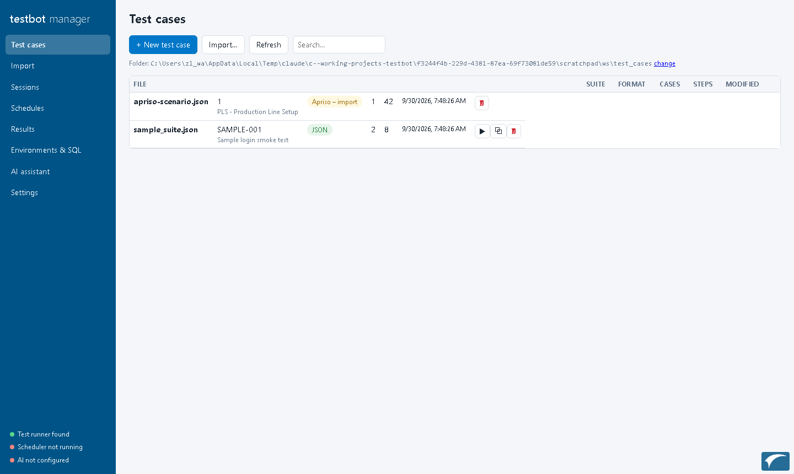

**Test cases** lists every `.json`/`.xlsx` file in the folder with its suite, number of cases and steps. From here you can create
a new test case, open, run ▶, duplicate or delete one (deleted files go to a recoverable `.testbot-bak` folder). A file that is not
in testbot format is marked **Needs import** and opens the Import page.

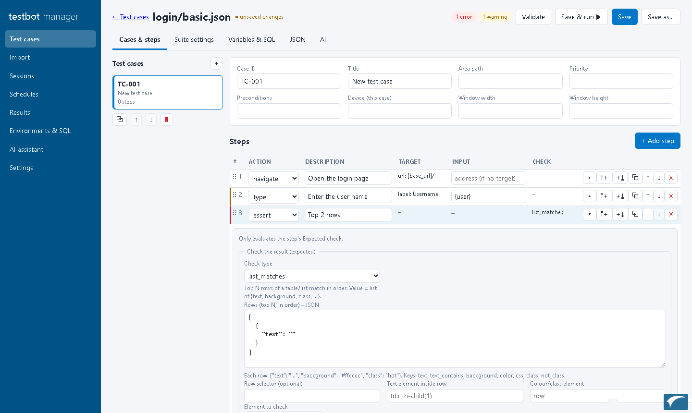

The editor has these tabs (the **History**, **Chat** and recommendation features are described in 20.3a – 20.3d):

- **Cases & steps** — the test cases of the file (left) and the steps of the selected case.
  - *Add step* at the end, *insert above / below* any step (`⤒+` / `+⤓`), *duplicate*, *move up / down* or **drag** by the `⋮⋮` handle, *delete*.
  - **Step numbers are automatic**: every insert, move or delete renumbers 1, 2, 3… (and the file is renumbered on save).
  - Every choice is a **list**: action, how to find the element (role, label, text, css…), the check type, what to capture, variable sources, keys, wait conditions.
    The list shows exactly what testbot supports. Click a step (or `▸`) to open its detail form: target with the optional *n-th match / scope / iframe / pop-up* settings, input, SQL, config, check, capture, timeouts.
  - The badge at the top shows **errors and warnings** (for example an action without a target, an unknown variable). Affected steps get a coloured bar; click a message to jump to the step. The runner's own rules are used, so “valid” here means the runner can load it.
- **Suite settings** — suite ID and name, base URL, environment, device/window size, what to do after a failed case, and the load-test settings (section 17).
- **Variables & SQL** — section 20.4.
- **JSON** — the file as text, for anything the forms do not cover. *Apply* takes your edits back into the editor.
- **AI** — section 20.7.

Saving:

- **Save** (or Ctrl+S) writes the file. The previous version is kept as `<file>.bak`. A test case that came from Excel is saved as a `.json` next to it.
- If the file was **changed by someone else** since you opened it, you are told and can reload, save under another name, or overwrite.
- **Save & run all ▶** saves, then runs the whole file with `testbot.exe` and shows the log live.
- **Run only some cases:** **☑** on a row of the list (or **Run cases…** in the editor) opens the case picker: *Whole test suite* or *Selected test cases* — tick them, order them with ↑↓, or tick everything with a *tag:* button. **Run ▶** runs just those, in that order. **Run this case ▶** in the editor saves and runs only the open case. **Copy to a new test file…** (in the same picker) creates a new file from the ticked cases — with the suite settings and any prerequisites they need; it never overwrites.
- **Add to a session:** **⇉** on a row (or **Add to session…** in the editor) adds the whole file, or ticked cases, to an existing or new session (section 16.1).
- Leaving the page with unsaved changes asks first.

### 20.3a Revisions: history of a suite and of its test cases

Every change to a suite file is kept as a **revision**, so you can see what changed, go back, and keep proposals (from the AI or the agent) separate until you accept them.

- **The file on disk is always the default version** — the one that runs. The runner, sessions, groups, schedules and git work as before. The history lives next to it, in a hidden folder `.revisions\<file>\`.
- **Test cases have their own revision numbers** (`rev 1, 2, 3…`); the **suite settings** (base URL, variables, connections …) have theirs. A **suite revision** (`r1, r2…`) is only a list that says which revision of each test case belongs together — for example `r14 = {settings s2, TC-1 rev 3, TC-2 rev 1, TC-3 rev 1}`. Changing one test case creates a new revision of that case and a new suite revision; the other cases are untouched. You can make an older revision of one case the default while the others stay on their latest.
- **Status.** Every suite and test case in the file carries `revision` and `status`: **default** (this is what runs), **draft** (a proposal; not run) or **superseded** (an older version). A file without them counts as the default; the next save adds them. A test case marked `draft` in a file is not run.
- **Saving the default creates a new revision** (the editor tells you: "Saved as suite revision r4: TC-2"). Saving without a change creates nothing.
- **A revision that is not the default is edited in place** — no new revision is created. In the **History** tab press *Edit this revision*: the normal editor opens on that revision with a banner (*Editing TC-1 revision 1, not the default*); *Save this revision* keeps the same number, *Save and make default* also puts it into use. Because a revision is one version, an in-place edit shows up in every suite revision that uses it.
- **History tab:** the suite revisions (what changed, **Changes** to see the difference with the previous one, *Make default*, *Delete*), and the revisions of the selected test case (*Compare with default*, *Edit this revision*, *Make default*, *Delete*). A step-level diff lists added, removed and changed steps and fields. The default cannot be deleted. The last **50** suite revisions are kept; older unused ones are removed.
- **Changes made outside testbot** (a text editor, a `git pull`) are noticed when you open the suite and recorded as a new revision ("changed outside testbot"), so nothing is silently overwritten.
- **Results** record the suite revision and each test case's revision that ran (shown on the test case page).
- The test list shows the revision of each file and how many drafts wait. Excel files are saved as a `.json` next to them and get a history from then on.

### 20.3b The agent suggests improvements (recommendations)

In **agentic** mode the AI agent finds the elements itself. With the **learn** option on, the agent's findings can improve the test case:

- **Turn it on:** per test case (*Natural-language test* box → *let the agent suggest improvements…*), for a whole suite/case with `"agent": {"learn": true}`, or for everything under **Settings → Agentic testing** (`TESTBOT_AGENT_LEARN=1`). It is off by default.
- **What happens:** after a **passing** agentic run, the steps the agent actually used — each with the element it identified, plus the checks it proved — are written into the test case as an extra node, `ai_recommendation` (status *pending*). **The runner ignores the node and it is not part of a revision, so nothing about the test changes by itself.** A failed or inconclusive run writes nothing, and secrets are never written.
- **Self-healing:** in a *scripted* run, when a target no longer matches and the AI element finder finds the element, a passing case gets a *self-healing recommendation* with the corrected target for each such step.
- **Review it:** the test case shows a box *AI recommendation… Review…* (and the sidebar page **Reviews** lists everything pending). The review screen shows each suggested step with a choice — **Skip**, **Add it (keep the original steps)**, or **Replace original step N** (pre-selected for the step that matches; healed steps line up with their original). You can apply part or all, tick *full replacement* to drop the originals that are not replaced, and add the variables the steps use. Apply **in the editor** (Save creates a new revision of the case) or **as a draft revision** (the default stays exactly as it is). The recommendation is then marked *applied* or *skipped*.

### 20.3c Chat: create and change test cases by conversation

The **Chat** tab of the editor (and the **Chat** tab of the AI assistant page) lets you talk to the AI about one suite: *"add a login step before step 3"*, *"create a case that checks the order total"*, *"why does step 4 need a wait?"*.

- The assistant sees the suite's settings, the test case you chose in full (change it with *Chat about*), the other cases as a one-line outline (a case you name by its id is sent in full) and the last messages. **Nothing is sent until you press Send** (Ctrl+Enter also sends). In the editor it sees your unsaved edits.
- Its answer is text plus, when it changes something, a **proposal**: complete test cases to *replace* or *add*, shown as a step-level diff. AI mistakes (unknown target strategies, empty targets, checks without an element) are tidied first and listed; a proposal that still does not validate is sent back to the model once and never shown.
- **Apply to the editor** puts the change into the open suite (Save creates a new revision, recorded with the source "chat" and your message as the note) — on the AI assistant page, *Apply* saves the revision straight away. **Save as a draft revision** keeps the default untouched; review the draft in the **History** tab. **Dismiss** ignores it.
- The conversation is **kept on disk per suite** (`.revisions\<file>\chat.json`); **Clear conversation** deletes it. Keep in mind that the test case you discuss is sent to the AI provider, as with *Optimize*.

### 20.3d Reviews

**Reviews** (sidebar) lists, across all suites, the recommendations waiting for review (agent and self-healing) and the draft revisions (from chat or recommendations). Click a row to open the suite on that test case.

### 20.4 Variables and SQL

The **Variables & SQL** tab manages:

- **Suite variables** and the **variables of the selected test case** — name, source (`constant`, `faker`, `sql`) and the fields that source needs.
- **SQL connections** of the suite (name → connection string; the string is hidden until you press the eye).
- **All SQL in this suite** — every query used by a variable or a `sql_query` / `sql_exec` step in one list, each with **Try**.

**Try** runs a query on the connection you choose and shows the first 25 rows. It is **read-only**: only a single `SELECT` is accepted, and
anything that could change data is refused. Use it to check that a query and connection work before the test does.

The **Environments & SQL** page edits `config/environments.yaml` (named base URLs and connections shared by many suites); the previous
file is kept as `environments.yaml.bak`. Connection strings are stored in plain text in these files — keep them in a protected folder.

### 20.5 Import test cases in any format

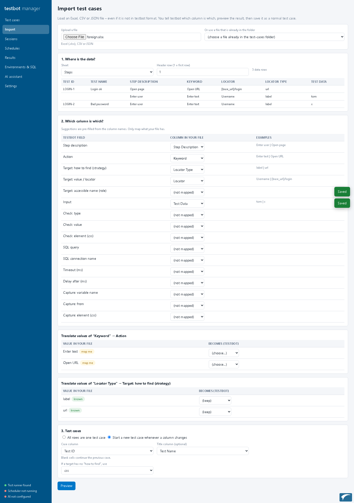

Open **Import** and give it a file (upload one, or pick one already in the folder):

- A file **already in testbot format** — nothing to do; it opens in the editor.
- An **Apriso AutomaticTest scenario** — converted with the control map (section 18), then previewed.
- **Any other Excel, CSV or JSON.** You map it in four steps:
  1. *Where is the data?* — choose the sheet and the header row (for JSON: the list that holds the steps).
  2. *Which column is which?* — for each testbot field (description, action, target, input, check…) choose the column of your file. Suggestions are pre-filled from the column names.
     For action, target type, check type and capture source, the wizard lists **the values found in your file** and lets you translate each one (for example “Enter text” → `type`). Unknown values are flagged.
  3. *Import as* — **script steps** (fixed actions and targets), or a **natural-language (agentic) test case**: the rows become the objective the AI agent carries out (step description, with action / target / input as hints) and the “Check: value” cells become the expected results. The suite is saved with `mode: agentic` and needs an AI provider key (section 21).
  4. *Test cases* — all rows are one test case, a column (such as “Test ID”) starts a new case (blank cells continue the previous one), or — for a workbook with several tabs — **each ticked tab is one test case** of the suite.
- **Excel with several tabs:** tick the tabs to import under *Where is the data?*; each becomes a test case named after the tab, all in one suite. Columns are matched **by name**, so a tab that spells a column differently (“Keyword” instead of “Action”) still maps; a mapped column that a tab does not have is left empty and reported in the warnings.
- **Test-management exports (ALM / Quality Center, similar tools):** guidance rows inside the data (such as “Name of test … (Required)”) and repeated header rows are skipped automatically. “Description (Design Steps)” is suggested as the step description, “Expected (Design Steps)” as the expected result and “Test Name” as the case title; a plain “Description” column becomes a **step heading** that is written in front of the step in natural-language imports. These files have no action column, so import them as natural language (agentic); importing them as script steps shows one hint instead of a list of errors. A tab that holds several tests (a “Test Name” column) can be imported on its own with *Start a new test case whenever a column changes*.
- **Preview** shows the result, with warnings for anything that could not be translated and the runner's validation. Nothing is saved until you press
  **Save as test case**; you can then fix the remaining points in the editor.

### 20.6 Sessions and schedules

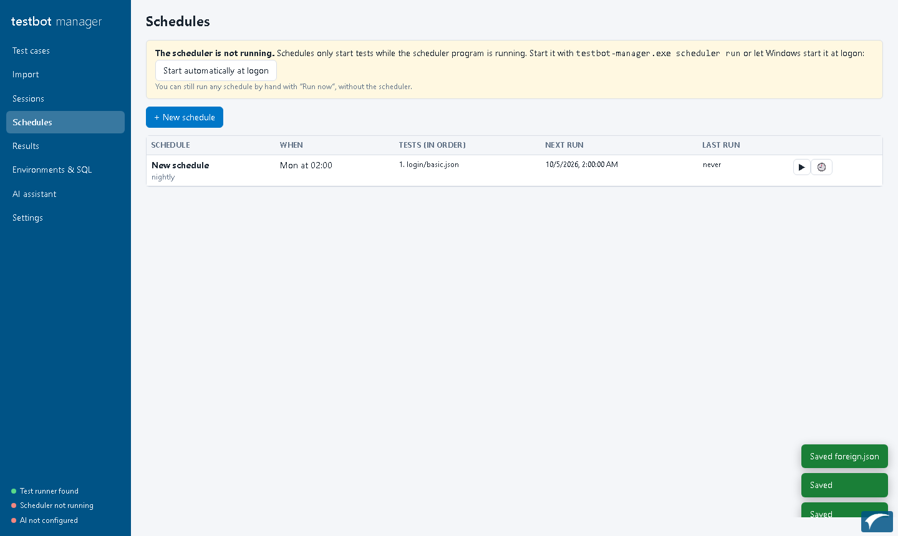

**Sessions** are ordered lists of test files or of chosen test cases (section 16); an entry can continue in the same logged-in browser as the previous one. A schedule item for a test file has a **Cases:** button to run only some of its cases.

**Schedules** say *what runs, in what order, and when*:

- **When:** manual only, once (date and time), every N minutes/hours, daily at a time, on chosen weekdays at a time, or monthly on a day.
- **What:** an ordered list of test files and/or sessions. Per item: an environment, load-test settings (workers, iterations, duration, ramp-up), screenshots, show the browser, a time limit, and *stop the schedule if this fails*. Items run one after the other, in the order shown.
- **A test group as a schedule item.** An item can be a **Test group**: pick the group and whether to run **all its test cases** or **only the cases not passed yet** (handy for a nightly retest of the failures during UAT). Each run builds a session from the group's cases (the group's own environment applies), so the results count in the group and its charts update. A closed group is not run (a clear message in the history), and an empty or missing group is reported. The group's email setting (or the Settings defaults) decides whether a mail is sent when it finishes.
- **Run now ▶** starts a schedule immediately from the page, with a live log and a *Cancel* button. This works **without** the scheduler program.
- **History** lists earlier runs with their status per test and a link to the log. Results of every run appear on the Results page.

**The scheduler program** starts schedules automatically. The Schedules page shows whether it is running.

```
testbot-manager.exe scheduler run          run in this console window (leave it open)
testbot-manager.exe scheduler install      start automatically every time you log in to Windows
testbot-manager.exe scheduler uninstall
testbot-manager.exe scheduler status
testbot-manager.exe scheduler run-once     start whatever is due now, then exit (to call from another timer)
testbot-manager.exe run-schedule nightly   run one schedule now and exit
```

Notes:

- `install` registers a normal Windows scheduled task (“testbot-scheduler”) that starts at logon. It is a background program, not a Windows service: it runs while you are logged in. For a machine where nobody logs in, use `--at startup` (needs administrator rights) or call `run-once` from your own timer.
- The scheduler checks every 15 seconds. If the computer or scheduler was **off at the planned time**, a run that is more than 10 minutes late is **skipped**, not replayed; the schedule continues at its next time.
- A schedule that is still running is never started a second time.
- Times are the computer's local time.

### 20.7 AI assistant (optional)

The AI assistant can **generate** a test case from a description (paste the page's HTML to get real labels), **optimise** an existing one (better waits and
targets, missing checks, clearer descriptions), or **convert** pasted text or another tool's script.

**Optimize** works on a test case *file*: choose the file, then either **all of its test cases** or **one test case**. Every test case is sent to the AI on its own (one request each, with a progress line), so a file with many test cases is never cut short and the cases you did not choose stay exactly as they are. A case the AI cannot improve is kept as it was and reported in the notes. In the editor, the **AI** tab has *Optimize this test case* (the open one) and *Optimize all test cases*.

On a company network that inspects HTTPS, also set your **root certificate** (and proxy) under *Settings → Company network* and use **Test connection to the AI service** (section 11.5).

Setup: choose the provider in Settings (Anthropic, OpenAI, Azure OpenAI or Gemini) and set its API key in an **environment variable** before starting the manager
(`ANTHROPIC_API_KEY`, `OPENAI_API_KEY`, `AZURE_OPENAI_API_KEY` + `AZURE_OPENAI_ENDPOINT` + `AZURE_OPENAI_DEPLOYMENT`, `GEMINI_API_KEY`). The key is never written to a file.

- Nothing is sent to the AI service unless you press an AI button. What you type (and, for *Optimize*, the test case) is what is sent — do not use it with data that must not leave your network.
- **Automatic tidy-up of the AI's answer.** AI models sometimes write steps testbot cannot run. Before the answer is checked, testbot rewrites a target strategy it does not know (`name`, `id`, `class`, `link_text` …) with one it does (for example `name=username` becomes `css: [name="username"]`), removes empty targets (`target: {}`), and gives an element check that has no element of its own one: a text check (`text_contains`, `text_equals`) looks at the **whole page** (`css: body`), and `visible` / `value_equals` use the step's own element. Every change is listed in the proposal's notes as *Fixed automatically* — review them, and narrow the whole-page checks where you can. The same safe rewrites (strategy names, empty targets) are applied when the manager saves a file.
- **Readable errors.** A suite that cannot be loaded now says which case and step and what is wrong, for example `case 1702637 (#2), step 2 "Enter username…": target strategy 'name' is not supported (use one of: …)`, both on the command line and when a session starts (exit code 2, before any browser opens). The editor's *Validate* shows the same wording.
- The answer is checked with the same rules as the editor, and if it is not valid the assistant asks the model to correct it once. The result is only a **proposal**: you review it, and decide to save it as a new file, add it to the open test case, or (for *Optimize*) replace the original. Nothing is saved by itself.
- AI output can be wrong. Run the test and read it before trusting it.

### 20.8 Results

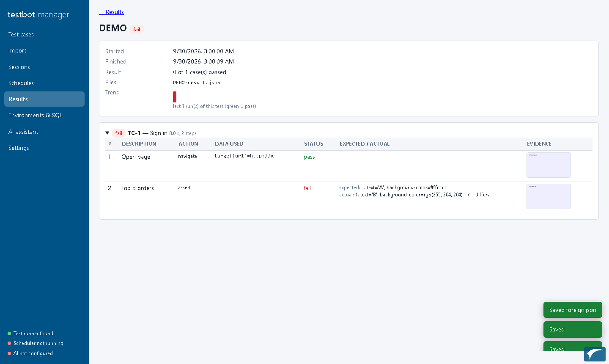

**Results** has four views: **By run** lists every run found in the results folder (suites, sessions, load runs) with status and counts, newest first; **By suite**, **By session** and **By test case** show the **final result and final test date / time** of each, and a test case opens a page with all its runs, the sessions it ran in and the step results of the run you pick (section 15.3). Filter by text, status or kind.
Open a run to see each test case and step: description, data used, status, **expected against actual**, the error, and the **screenshot** (click to enlarge).
A small bar shows the last runs of the same test (green = passed) — click one to open it. A load run shows its settings, the per-worker totals and every single run with its time.
*HTML report* opens the report that testbot wrote next to the results.

### 20.8a Test groups: tracking a test effort (for example UAT)

A **test group** is a named set of **sessions, test suites and individual test cases** that you track together — for example *UAT cycle 1*: 100 test cases that start on Monday. Open **Test groups** in the sidebar.

**Create one** (*+ New test group*): a name, a start date (results before it do not count), an optional end date (empty = up to today) and an optional **environment** (only runs against that environment count, e.g. `uat`; the environment recorded in a result is the one the run used — `--env`, or the session's). Then add **members** — any mix of:

- **+ Session…** — every test case the session runs (each entry's whole suite or its selected cases / tags);
- **+ Test suite…** — all the test cases of a suite;
- **+ Test cases…** — chosen test cases of a suite (the case picker).

A test case reached through more than one member **counts once**; the editor shows the live count ("6 test cases, 1 reached through more than one member"). A **live** group follows its sessions and suites as they change; tick **Freeze the list** to keep the test cases the group had when you saved it (a UAT scope that must not drift). Delete or duplicate a group from the list — tests and results are never touched.

**Tracking** (the group page, tab *Progress & results*). Each test case's **final result** is its latest result **inside the period** (and on the environment): a re-test after a fix replaces the failure; no result = **not run**. You see:

- the figures — test cases, executed %, passed %, how many passed at the first attempt, still to do;
- **Final results** — a donut (click a slice or legend entry to list those cases);
- **Progress by day** — the final result of every case at the end of each day since the start (the burn-up);
- **By member** — passed / total for each session, suite or set of cases;
- **Executions per day**;
- the **test case table** — final result, final test time, attempts, which member(s) it came from, the problem; filters: not run, fail, error, retested (failed, then passed), not passed yet. Click a case for its case page (all runs, step results).

Every chart can be downloaded (**PNG** or **SVG**). Charts are drawn in the page, so they work offline.

**Actions**

- **Run all cases ▶** — runs every test case of the group as a session built from them (the environment of the group applies).
- **Run what has not passed (N) ▶** — runs only the test cases that are not run or failing, across all the suites, as a session built for you (environment of the group); the results count in the group automatically. Disabled when the group is closed.
- **Record result…** (per test case) — for tests done by hand: pass or fail, who, and a comment. A manual result counts like a run (the latest wins) and is marked *manual*.
- **Export CSV** and **Sign-off report (HTML)** — the report has the period, the figures, the donut and the daily chart, the table by member and every test case with its final result and time.
- **Close the cycle (sign-off)** — records the sign-off time and fixes the end date at today; **Re-open** undoes it.

The **suite** and **session** result pages have an **Analysis** block (donut, results by day, executions per day) for a chosen range — last 7 / 30 / 90 / 180 days — and the case and suite pages list the groups that include them.

Groups are small files in the `groups` folder of the workspace (`groups\<id>.json`).

### 20.9 Limits

- The manager edits **JSON** files. An Excel test case is opened, and saved as a JSON copy; the original Excel file is not changed.
- Only one person should edit a file at a time; the “file changed on disk” warning protects against overwriting.
- The scheduler and *Run now* need `testbot.exe`; without it you can still edit, import and view results.
- The AI assistant, and trying SQL against your database, depend on your environment (API key, network, ODBC driver) — the Settings and Environments pages show what is missing.

---

## 21. Agentic testing: tests written in plain language (pilot)

*Status: a pilot. The mechanics are built and tested with a scripted stand-in for the AI model and with a fake model server through the real command line and SDK. It has **not yet been run with a real AI model on a real application** (including Apriso): that is the next step, and it will show how good the agent is. The design and the reasons for it are in `docs/AGENTIC_TESTING_RESEARCH.md`.*

An **agentic test** is a test case you write as a goal in ordinary words — *“Add a production line and confirm it appears in the list”* — instead of a list of steps. An **AI agent** drives the browser to reach the goal, **decides the test data** itself, **decides what to check**, and reports a verdict backed by checks that testbot runs. Everything from the earlier sections still works; script mode stays the default.

### 21.1 When to use which

| Script tests (sections 5–14) | Agentic tests (this section) |
|---|---|
| Exactly repeatable, fast, free to run, reviewable line by line | Quick to write, tolerant of small screen changes, the agent chooses data and checks |
| Best for regression and load tests | Best for new features, exploration, and for **drafting** a script |
| You write every step | You write the goal; the run can be **exported as a script** (21.6) |

A good routine: let the agent run a new test once or twice, review what it did, save the **generated script**, and run that in script mode from then on — cheap and deterministic.

### 21.2 Choosing the mode

| Setting | Values |
|---|---|
| `TESTBOT_MODE` (environment variable) | `script` (default), `agentic`, `auto` |
| `--mode` (command line), `mode` (suite or case in the file) | same |

The command line wins over the environment, which wins over the case, which wins over the suite; with nothing set, it is `script`.

| Mode | What happens |
|---|---|
| `script` | Only scripted steps run, as before. A natural-language case (objective but no steps) is reported **inconclusive — “no script to run”**; it is never guessed. |
| `agentic` | Cases with an `objective` are run by the agent. Cases that only have steps still run as scripts. |
| `auto` | A case with steps runs as a script; a case with only an objective is run by the agent. |

```
testbot.exe suite --suite test_cases\orders-nl.json --mode agentic
set TESTBOT_MODE=agentic
testbot.exe suite --suite test_cases\orders-nl.json
```

In the manager: Suite settings → *Mode*, the case's *Natural-language test* panel → *Mode for this case*, a schedule item's *Mode*, and **Settings → Agentic testing** (defaults passed to every test the manager starts).

### 21.3 Writing a natural-language test

In JSON, a case gets these optional fields (only `objective` is needed):

```json
{ "id": "TC-PL-01", "title": "Add a production line",
  "objective": "Open Production Line Setup, add a new production line with a unique number and a description, and confirm it appears in the list.",
  "data_hints": "Line numbers start with TEST_ and must be unique per run.",
  "expect": ["The new line is listed", "No error message is shown"],
  "constraints": ["Do not delete any existing line"],
  "start_url": "{base_url}/apriso/portal" }
```

| Field | Meaning |
|---|---|
| `objective` | The goal, in plain words. |
| `data_hints` | Optional guidance about the data to use. |
| `expect` | Optional list of outcomes that must be **proven**. Each needs a passing check for the test to pass. Without it the agent decides what to check, but must still run at least one check. |
| `constraints` | Things the agent must not do. |
| `start_url` | Optional address to open first. |
| `mode`, `agent` | Per-case mode and agent settings (for example `{"max_steps": 25}`). |

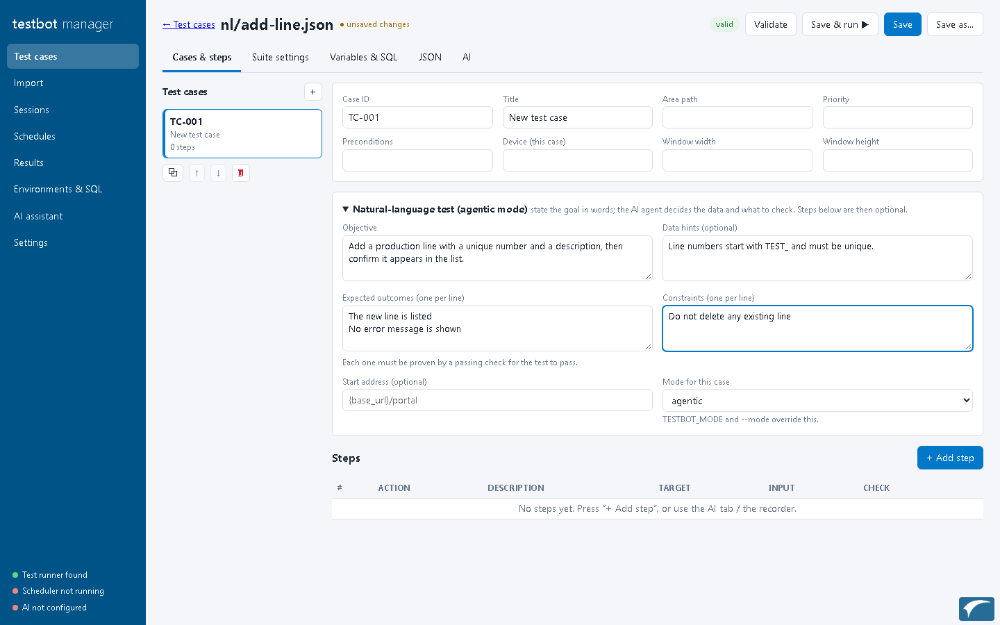

**In Excel:** on the case sheet add the rows `Objective`, `DataHints`, `Expect` (one outcome per line in the cell), `Constraints`, `StartUrl`, `Mode` to the top block; the steps table (with its `StepNo` header row) may stay empty. The Suite sheet accepts a `Mode` column.

**One plain-language step inside a script:** the action `agent` lets a scripted test hand over one hard part and then carry on scripted:

```json
{"step_no": 4, "description": "Fill the order form", "action": "agent",
 "input": "Fill the order form with valid data and submit it",
 "config": {"expect": ["The order is listed as New"], "max_steps": 15}}
```

### 21.4 What the agent does

The agent repeats: **look** at the page → **decide** → **act** → look again, until it reports a verdict or a limit is reached.

- **What it sees:** a compact numbered list of the visible controls on the page, inside every iframe, and in any open pop-up (pop-up controls first); the contents of tables and grids; messages shown on screen; visible text; and network or console errors. It can also be given a screenshot (21.8).
- **What it can do:** open an address, click, type, choose an option, tick a box, press a key, wait for text, scroll, look (screenshot), remember a value (`set_variable`), write a note, **read** the database (`query_db`, `SELECT` only), **check** something (`assert`), and `finish`.
- **Test data:** it uses data you give it; otherwise it decides values itself, respecting what the screen says about each field (required, maximum length, pattern, allowed options), and makes names unique per run with the built-in `{run_id}` (for example `TEST_{run_id}`). It never invents real personal data. **Passwords and other secrets exist only as `{variables}`: their values are never shown to the model.** Every value it used is listed in the report under *data decisions*, with where it came from.
- **What to check:** your `expect` list, plus what a user would check (the result is visible, a list now shows it, no error message) and, if a database is available, that the data was saved. Each check is run by testbot's own checking engine (text shown, URL, element text/value, colours, table rows, SQL result…).

### 21.5 Verdicts: why a pass can be trusted

The agent states a verdict, but **testbot only accepts a pass when the evidence supports it**:

| Verdict | When |
|---|---|
| **pass** | Every stated outcome is proven by a *passing* check, at least one check was run, no check is failing, no server error happened, and no error message is left on screen (unless the test is about an error). |
| **fail** | A check failed (the report shows expected against actual), or a server error/error message appeared, or the agent reported a failure. A failure that no failed check backs up is marked *AI judgement only*. |
| **inconclusive** | The agent could not finish or could not verify an outcome — for example *“expected outcome #2 was not verified by any passing check”* or *“no check was executed”*. It is **never** shown as a pass. |
| **error** | A problem running it: the AI service was unreachable, no API key, or a limit was reached (step, token or time budget). |

If the agent claims a pass that the evidence does not support, the verdict is downgraded and the report says why.

### 21.6 Reading the result, and turning a run into a script

The result looks like any other test: each action the agent took is a **step** (with its reason, the data used and a screenshot), each check shows **expected / actual**, and a final **Agent verdict** step shows the model used, the number of model calls and tokens, the data decisions, and two files in the run folder:

- `agent-traces\<case>.json` — the full reasoning trace: every action, reason, result, check and data decision.
- `agent-generated\<case>.json` — **the run exported as a normal testbot test**: the actions that worked, with targets that were verified to find exactly the element used, and the checks that passed. Secrets appear as `{variables}` set to `CHANGE_ME`; the run's unique value becomes `{run_id}` so the script can be repeated.

Review it, copy it into your test cases folder and run it in script mode (`--mode script`, the default). In tests it replayed twice in script mode with no AI involved.

### 21.7 Safety

| Risk | Protection |
|---|---|
| Wandering off to other sites | Only the test's own site (its `base_url` / `start_url` host) is allowed; other addresses are refused. Add hosts with `TESTBOT_AGENT_ALLOWED_HOSTS`. |
| Destructive actions | Clicking something that looks like delete / remove / pay / send / approve… is refused unless the **objective asks for it** and no constraint forbids it (or `TESTBOT_AGENT_ALLOW_DESTRUCTIVE=1`). |
| Changing data through SQL | The agent can only `SELECT`. |
| Secrets | Typed only as `{variable}` references; literal passwords are refused; values are hidden from the model, the report and the generated script. |
| Text on the page that tries to give the agent orders (“ignore your instructions and…”) | Page content is treated as untrusted data; the tools, the site limit and the destructive-action rule apply whatever a page says. |
| Runaway cost | Limits on actions (`TESTBOT_AGENT_MAX_STEPS`, default 40), tokens and time; going in circles is detected. |

### 21.8 Settings

All optional. In the manager: **Settings → Agentic testing** (passed to the tests it starts). Otherwise environment variables, which can also be placed in a `.env` file next to `testbot.exe` (section 11.4):

| Variable | Default | Meaning |
|---|---|---|
| `TESTBOT_MODE` | `script` | `script` / `agentic` / `auto` |
| `TESTBOT_AGENT_PROVIDER`, `TESTBOT_AGENT_MODEL` | `anthropic`, provider default | The agent supports **Anthropic, OpenAI and Azure OpenAI**. Keys are the usual `ANTHROPIC_API_KEY`, `OPENAI_API_KEY`, `AZURE_OPENAI_*`. (Gemini is not supported for the agent yet.) |
| `TESTBOT_AGENT_MAX_STEPS`, `TESTBOT_AGENT_MAX_TOKENS`, `TESTBOT_AGENT_TIMEOUT_S` | 40, 400000, 600 | Budgets for one test |
| `TESTBOT_AGENT_VISION` | `auto` | What is sent to the model besides text: `off` = never a screenshot; `auto` = one at the start, after a failed action, and when the agent asks; `always` = with every step. **Screenshots of the application leave your network** unless your provider is an internal one — use `off` if that is not allowed. |
| `TESTBOT_AGENT_ALLOW_DESTRUCTIVE` | `0` | Allow delete/pay/send-type actions |
| `TESTBOT_AGENT_ALLOWED_HOSTS` | – | Extra allowed hosts, comma separated |
| `TESTBOT_AGENT_PROFILE` | – | An application profile (below) |

The screenshots sent to the model carry the same small IACF logo as the evidence screenshots (`TESTBOT_WATERMARK=off` removes it).

Company networks: the agent uses the root certificate and proxy settings of section 11.5, and `ANTHROPIC_BASE_URL` / `OPENAI_BASE_URL` / `AZURE_OPENAI_ENDPOINT` can point to an internal AI gateway.

**Application profile.** A small YAML file that tells the agent how an application looks: which iframe holds the screen, how to recognise a pop-up, which “busy” indicator to wait for, and notes in plain words. `config\app_profile_apriso.yaml` is included for Apriso (screen in `.apr-fullscreen-tab`, pop-ups `.apr-popup`, spinner `.apr-ctspinner`, grid conventions, “log out when done”). Without a profile the agent still works, but has to work these out for itself.

### 21.9 Trying it on Apriso

1. Set the key: `set ANTHROPIC_API_KEY=…` (and the root certificate, if your network needs it — section 11.5).
2. `set TESTBOT_AGENT_PROFILE=config\app_profile_apriso.yaml`
3. Write a case like the example in 21.3 with `base_url` = `http://server/apriso/apriso` (and your login as variables `login_name` / `login_password`).
4. Run `testbot.exe suite --suite … --mode agentic --headed` and watch. Read the result and the trace.
5. Run it several times. If the agent is reliable, save the generated script and use that for regression.

Start with one simple screen on a test system. The agent creates real data exactly as a person would, and an unregistered Apriso limits concurrent users, so make sure the test logs out.

### 21.10 Limits of the pilot

- **Not yet proven with a real model.** Expect to tune the prompts and the application profile after the first real runs. Measure success rate, the number of model calls and time per test before relying on it.
- Slower and costlier than scripts: each action is a model call. A test of 15–25 actions is an estimated tens of thousands to a few hundred thousand tokens; the report shows the real figure.
- Non-deterministic: two runs may take different paths; the verdict rules above exist to protect you from this.
- **Not built yet:** automatic “heal” proposals when a script breaks (`auto` mode only chooses script-or-agent), a review screen for generated scripts in the manager, and agent support for load tests. The generated script is a file you review by hand.
- Elements inside iframes nested more than one level deep are not reached.

---

## 22. Quick reference

**Minimal suite**
```json
{"suite_id":"S1","suite_name":"My test","base_url":"http://server/app",
 "cases":[{"id":"TC-001","title":"Open home","steps":[
   {"step_no":1,"description":"Open","action":"navigate","target":{"strategy":"url","value":"{base_url}/"},
    "expected":{"type":"url_contains","value":"/"}}]}]}
```

**Commands**
```
testbot-recorder.exe                                   record a test
testbot.exe suite --suite F [--env E] [--headed]       run a test file
testbot.exe session --plan P                           run files in order
testbot.exe convert-apriso --in F                      convert an Apriso scenario
testbot.exe suite --suite F --workers 5 --duration 300 --ramp-up 30   load test (5 workers, 5 minutes)
testbot-manager.exe                                    browser UI: edit, import, schedule, results (section 20)
testbot-manager.exe scheduler run                      start scheduled tests when they are due
testbot.exe suite --suite F --mode agentic             natural-language tests run by the AI agent (section 21)
```

**Actions:** navigate · click · type · select · check · hover · press · scan · scroll · upload · wait · wait_until ·
screenshot · sql_query · sql_exec · set_var · assert · rest_call · bus_subscribe · bus_wait · bus_publish

**Targets:** role · label · placeholder · text · testid · css · xpath · row_containing · table_cell · url · ai
(options: nth · scope · frame · scope_if_present)

**Checks (`expected.type`):** url_equals · url_contains · text_equals · text_contains · value_equals · visible ·
hidden · count_equals · sql_result_equals · css_equals · has_class · list_matches

**Capture (`from`):** element_text · element_value · url · sql_column

**Variable sources:** constant · faker · sql

**Files after a run:** `reports\<id>.html` (read this) · `<id>-junit.xml` · `<id>-result.json` · screenshot folder

**More commands and switches**
```
testbot.exe suite --suite F --case TC-5 --case TC-2     run chosen cases in that order (section 14.1a)
testbot.exe suite --suite F --tag smoke                 run the cases with a tag
testbot.exe suite --suite F --log-level debug           more detail in the run log (section 15.1)
```
Manager pages: Test cases (editor, History, Chat) · Variables · Import · Sessions & schedules · AI · Results · Groups · Reviews · Settings.
Environment switches: `TESTBOT_LOG_LEVEL` · `TESTBOT_AGENT_LEARN` · `TESTBOT_EMAIL_HOST` (and the other `TESTBOT_EMAIL_*` defaults).
